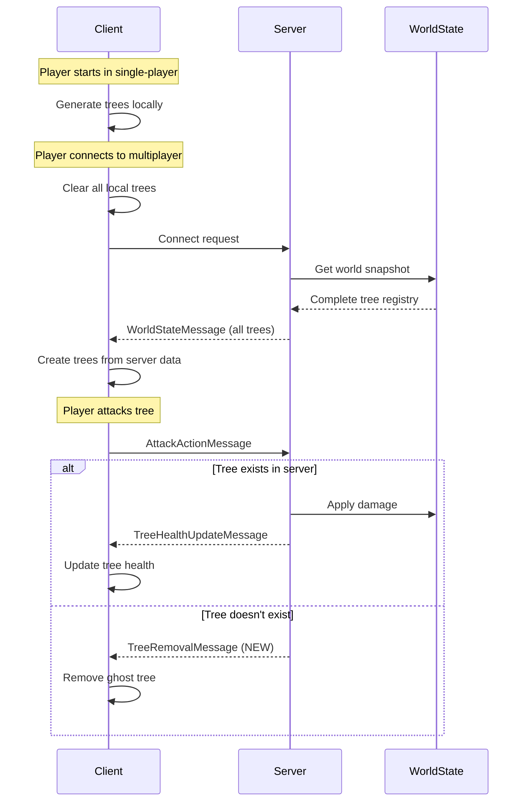

# Design Document

## Overview

The ghost tree issue occurs when clients render trees that don't exist in the server's authoritative world state. Based on the logs showing "No tree exists at position -512,576", the client has a tree at that position but the server doesn't. This design addresses the root cause and implements comprehensive fixes to ensure perfect tree synchronization.

### Root Cause Analysis

After analyzing the codebase, the ghost tree problem stems from:

1. **Client-Side Tree Generation in Multiplayer**: The `generateTreeAt()` method in `MyGdxGame.java` has a check `if (gameMode != GameMode.SINGLEPLAYER) return;` but this only prevents NEW trees from being generated. Trees that were already generated BEFORE entering multiplayer mode remain in the client's maps.

2. **Incomplete World State Clearing**: When transitioning from single-player to multiplayer, the client doesn't clear existing trees from its local maps before receiving the server's world state.

3. **No Ghost Tree Cleanup**: When the server rejects an attack on a non-existent tree, there's no mechanism to remove that ghost tree from the client.

4. **Deterministic Generation Mismatch**: The server's `generateInitialTrees()` only generates trees in a 5000x5000 area (-2500 to +2500), but clients may have generated trees outside this area in single-player mode before connecting.

## Architecture

### Component Interaction Flow



## Components and Interfaces

### 1. New Message Type: TreeRemovalMessage

A new network message to explicitly tell clients to remove ghost trees.

```java
public class TreeRemovalMessage extends NetworkMessage {
    private String treeId;
    private String reason; // For logging/debugging
    
    public TreeRemovalMessage(String senderId, String treeId, String reason) {
        super(senderId, MessageType.TREE_REMOVAL);
        this.treeId = treeId;
        this.reason = reason;
    }
    
    // Getters
}
```

### 2. Enhanced ClientConnection (Server-Side)

**File**: `src/main/java/wagemaker/uk/network/ClientConnection.java`

**Changes**:
- When a tree attack fails (tree doesn't exist), send `TreeRemovalMessage` to the client
- Add diagnostic logging for ghost tree detection
- Remove the dynamic tree creation logic that attempts to recreate trees

**Current Problematic Code** (lines 400-470):
```java
// If tree doesn't exist in server state, we need to create it from the targetId
if (tree == null) {
    // Parse position and create tree using deterministic generation
    // ...
}
```

**New Approach**:
```java
// If tree doesn't exist in server state, it's a ghost tree on the client
if (tree == null) {
    System.err.println("No tree exists at position " + targetId);
    logSecurityViolation("Attack on non-existent tree: " + targetId);
    
    // Send tree removal message to client
    TreeRemovalMessage removalMsg = new TreeRemovalMessage("server", targetId, 
        "Tree does not exist in server world state");
    sendMessage(removalMsg);
    return;
}
```

### 3. Enhanced MyGdxGame (Client-Side)

**File**: `src/main/java/wagemaker/uk/gdx/MyGdxGame.java`

**Changes**:

#### A. Clear Trees on Multiplayer Connection

Add method to clear all local trees before syncing with server:

```java
/**
 * Clears all locally generated trees and items.
 * Called when transitioning to multiplayer mode.
 */
private void clearLocalWorld() {
    System.out.println("Clearing local world state for multiplayer...");
    
    // Dispose and clear all trees
    for (SmallTree tree : trees.values()) {
        tree.dispose();
    }
    trees.clear();
    
    for (AppleTree tree : appleTrees.values()) {
        tree.dispose();
    }
    appleTrees.clear();
    
    for (CoconutTree tree : coconutTrees.values()) {
        tree.dispose();
    }
    coconutTrees.clear();
    
    for (BambooTree tree : bambooTrees.values()) {
        tree.dispose();
    }
    bambooTrees.clear();
    
    for (BananaTree tree : bananaTrees.values()) {
        tree.dispose();
    }
    bananaTrees.clear();
    
    // Clear items
    for (Apple apple : apples.values()) {
        apple.dispose();
    }
    apples.clear();
    
    for (Banana banana : bananas.values()) {
        banana.dispose();
    }
    bananas.clear();
    
    // Clear cleared positions
    clearedPositions.clear();
    
    System.out.println("Local world cleared");
}
```

#### B. Call clearLocalWorld() Before Connecting

Modify `startMultiplayerHost()` and `joinMultiplayerServer()`:

```java
public void startMultiplayerHost() throws Exception {
    // ... existing validation ...
    
    // Clear local world before starting multiplayer
    clearLocalWorld();
    
    // ... rest of existing code ...
}

public void joinMultiplayerServer(String serverAddress, int port) throws Exception {
    // ... existing validation ...
    
    // Clear local world before joining
    clearLocalWorld();
    
    // ... rest of existing code ...
}
```

#### C. Enhanced syncWorldState() with Logging

```java
public void syncWorldState(WorldState state) {
    if (state == null) {
        return;
    }
    
    System.out.println("Synchronizing world state...");
    System.out.println("  World seed: " + state.getWorldSeed());
    System.out.println("  Trees to sync: " + (state.getTrees() != null ? state.getTrees().size() : 0));
    System.out.println("  Players to sync: " + (state.getPlayers() != null ? state.getPlayers().size() : 0));
    System.out.println("  Items to sync: " + (state.getItems() != null ? state.getItems().size() : 0));
    
    // ... existing sync logic ...
    
    System.out.println("World state synchronized");
    System.out.println("  Local trees after sync: " + getTotalTreeCount());
}

private int getTotalTreeCount() {
    return trees.size() + appleTrees.size() + coconutTrees.size() + 
           bambooTrees.size() + bananaTrees.size();
}
```

### 4. Enhanced GameMessageHandler (Client-Side)

**File**: `src/main/java/wagemaker/uk/gdx/GameMessageHandler.java`

**Changes**:

Add handler for new TreeRemovalMessage:

```java
@Override
protected void handleTreeRemoval(TreeRemovalMessage message) {
    System.out.println("Server requested removal of ghost tree: " + message.getTreeId());
    System.out.println("  Reason: " + message.getReason());
    game.removeTree(message.getTreeId());
}
```

### 5. Enhanced DefaultMessageHandler

**File**: `src/main/java/wagemaker/uk/network/DefaultMessageHandler.java`

**Changes**:

Add method stub for tree removal:

```java
protected void handleTreeRemoval(TreeRemovalMessage message) {
    // Default implementation - subclasses should override
    System.out.println("Tree removal: " + message.getTreeId());
}
```

Update message routing in `handleMessage()`:

```java
case TREE_REMOVAL:
    handleTreeRemoval((TreeRemovalMessage) message);
    break;
```

### 6. MessageType Enum

**File**: `src/main/java/wagemaker/uk/network/MessageType.java`

**Changes**:

Add new message type:

```java
public enum MessageType {
    // ... existing types ...
    TREE_REMOVAL,
    // ... rest ...
}
```

## Data Models

### TreeRemovalMessage

```java
public class TreeRemovalMessage extends NetworkMessage implements Serializable {
    private static final long serialVersionUID = 1L;
    
    private String treeId;      // Position key "x,y"
    private String reason;      // Diagnostic reason for removal
    
    // Constructor, getters, setters
}
```

### Enhanced Logging Data

Track ghost tree incidents for diagnostics:

```java
// In ClientConnection
private Map<String, Integer> ghostTreeAttempts = new HashMap<>();

private void logGhostTreeAttempt(String treeId) {
    int count = ghostTreeAttempts.getOrDefault(treeId, 0) + 1;
    ghostTreeAttempts.put(treeId, count);
    
    System.err.println("[GHOST_TREE] Client " + clientId + 
                      " attacked non-existent tree " + treeId + 
                      " (attempt #" + count + ")");
}
```

## Error Handling

### 1. Connection Transition Errors

**Scenario**: Client fails to clear local world before connecting

**Handling**:
- Wrap `clearLocalWorld()` in try-catch
- Log any disposal errors but continue
- Ensure connection proceeds even if some resources fail to dispose

```java
private void clearLocalWorld() {
    try {
        // ... disposal logic ...
    } catch (Exception e) {
        System.err.println("Error clearing local world: " + e.getMessage());
        e.printStackTrace();
        // Continue anyway - server state will override
    }
}
```

### 2. Ghost Tree Removal Errors

**Scenario**: Client receives TreeRemovalMessage for a tree that doesn't exist locally

**Handling**:
- Log the incident (might indicate desync)
- Don't throw error - it's a no-op
- Continue normal operation

```java
public void removeTree(String treeId) {
    boolean found = removeTreeImmediate(treeId);
    if (!found) {
        System.out.println("Attempted to remove non-existent tree: " + treeId);
    }
}
```

### 3. World State Sync Timeout

**Scenario**: Client connects but doesn't receive WorldStateMessage

**Handling**:
- Implement timeout in GameClient (5 seconds)
- Disconnect and show error if no world state received
- Allow retry

```java
// In GameClient
private static final long WORLD_STATE_TIMEOUT = 5000; // 5 seconds
private long connectionTime;
private boolean worldStateReceived;

// Check in update loop
if (!worldStateReceived && 
    System.currentTimeMillis() - connectionTime > WORLD_STATE_TIMEOUT) {
    disconnect();
    throw new TimeoutException("Did not receive world state from server");
}
```

## Testing Strategy

### Unit Tests

1. **TreeRemovalMessage Serialization Test**
   - Verify message can be serialized/deserialized
   - Test with various tree IDs and reasons

2. **clearLocalWorld() Test**
   - Create trees in single-player
   - Call clearLocalWorld()
   - Verify all maps are empty
   - Verify no memory leaks

3. **Ghost Tree Detection Test**
   - Simulate client attacking non-existent tree
   - Verify TreeRemovalMessage is sent
   - Verify security log entry created

### Integration Tests

1. **Single-Player to Multiplayer Transition Test**
   - Start in single-player
   - Generate trees by exploring
   - Connect to multiplayer server
   - Verify local trees are cleared
   - Verify only server trees exist

2. **Ghost Tree Cleanup Test**
   - Manually create ghost tree on client
   - Attack the ghost tree
   - Verify server sends TreeRemovalMessage
   - Verify client removes the tree
   - Verify no further attacks possible

3. **World State Sync Test**
   - Server generates 1000 trees
   - Client connects
   - Verify client receives all 1000 trees
   - Verify tree positions match server
   - Verify tree types match server

### Manual Testing Scenarios

1. **Scenario: Fresh Connection**
   - Start server
   - Connect client (no prior single-player)
   - Explore world
   - Attack trees
   - Expected: All trees attackable, no ghost trees

2. **Scenario: Single-Player Then Multiplayer**
   - Play single-player for 5 minutes
   - Explore far from spawn
   - Connect to multiplayer server
   - Return to previously explored areas
   - Expected: Different trees than single-player, no ghost trees

3. **Scenario: Multiple Clients**
   - Client A connects and explores
   - Client B connects
   - Both clients attack same tree
   - Expected: Both see same tree health, synchronized destruction

4. **Scenario: Ghost Tree Recovery**
   - Artificially create ghost tree (modify code temporarily)
   - Attack ghost tree
   - Expected: Server sends removal message, tree disappears, log entry created

## Performance Considerations

### 1. World State Message Size

**Issue**: Sending all trees on connection could be large (1000+ trees)

**Optimization**:
- Trees are already quantized to pixel positions
- Use efficient serialization (ObjectOutputStream)
- Typical tree count: ~1000 trees
- Typical message size: ~50KB (acceptable for TCP)

**Monitoring**:
```java
System.out.println("World state message size: " + 
    (trees.size() * 32) + " bytes (approx)");
```

### 2. clearLocalWorld() Performance

**Issue**: Disposing 1000+ trees could cause frame drop

**Optimization**:
- Already happens during connection (loading screen acceptable)
- Disposal is fast (just texture cleanup)
- Typical time: <100ms

**Monitoring**:
```java
long startTime = System.currentTimeMillis();
clearLocalWorld();
long duration = System.currentTimeMillis() - startTime;
System.out.println("World clear took: " + duration + "ms");
```

### 3. Ghost Tree Detection Overhead

**Issue**: Checking for non-existent trees on every attack

**Optimization**:
- HashMap lookup is O(1)
- No additional overhead
- Security logging is minimal

## Security Considerations

### 1. Malicious Ghost Tree Attacks

**Threat**: Client repeatedly attacks non-existent trees to spam server

**Mitigation**:
- Existing rate limiting (100 messages/second)
- Security violation logging
- Automatic disconnect after threshold

```java
private int ghostTreeAttackCount = 0;
private static final int MAX_GHOST_TREE_ATTACKS = 10;

if (tree == null) {
    ghostTreeAttackCount++;
    if (ghostTreeAttackCount > MAX_GHOST_TREE_ATTACKS) {
        System.err.println("Client " + clientId + " exceeded ghost tree attack limit");
        running = false; // Disconnect
        return;
    }
    // ... send removal message ...
}
```

### 2. Tree Position Validation

**Threat**: Client sends attack for tree at invalid position (NaN, Infinity)

**Mitigation**:
- Already implemented in `isValidPosition()`
- Validates before processing attack
- Logs security violation

### 3. World State Tampering

**Threat**: Client modifies received world state

**Mitigation**:
- Server is authoritative - client changes don't matter
- All actions validated server-side
- Position corrections sent if desync detected

## Deployment Considerations

### Backward Compatibility

**Issue**: New TreeRemovalMessage not recognized by old clients

**Solution**:
- Old clients will ignore unknown message type
- They'll keep ghost trees but can't attack them (server rejects)
- Recommend all clients update together

### Migration Path

1. Deploy server update first
2. Server sends TreeRemovalMessage (old clients ignore)
3. Deploy client updates
4. Clients now handle ghost tree removal

### Rollback Plan

If issues arise:
1. Revert server to not send TreeRemovalMessage
2. Clients will have ghost trees but no crashes
3. Fix issues and redeploy

## Monitoring and Diagnostics

### Server-Side Metrics

```java
// Track ghost tree incidents
private static int totalGhostTreeAttacks = 0;
private static Map<String, Integer> ghostTreeHotspots = new HashMap<>();

// Log periodically
System.out.println("[METRICS] Total ghost tree attacks: " + totalGhostTreeAttacks);
System.out.println("[METRICS] Ghost tree hotspots: " + ghostTreeHotspots);
```

### Client-Side Metrics

```java
// Track tree sync
System.out.println("[METRICS] Trees received from server: " + receivedTreeCount);
System.out.println("[METRICS] Trees removed as ghosts: " + ghostTreesRemoved);
System.out.println("[METRICS] Current tree count: " + getTotalTreeCount());
```

### Log Analysis

Search for patterns:
- `[GHOST_TREE]` - Ghost tree attacks
- `[SECURITY]` - Security violations
- `Clearing local world` - Multiplayer transitions
- `World state synchronized` - Successful syncs

## Future Improvements

### 1. Chunk-Based Tree Loading

Instead of sending all trees at once, send trees in chunks as players explore:

```java
// Server tracks which chunks each client has loaded
Map<String, Set<String>> clientLoadedChunks;

// Send trees only for new chunks
void sendChunkTrees(String clientId, String chunkId) {
    // ...
}
```

### 2. Tree State Checksums

Periodically verify client tree state matches server:

```java
// Client sends checksum of tree positions
String treeChecksum = calculateTreeChecksum();

// Server compares and sends corrections if mismatch
if (!serverChecksum.equals(clientChecksum)) {
    sendFullTreeSync();
}
```

### 3. Predictive Ghost Tree Detection

Client-side detection before attacking:

```java
// Before sending attack, check if tree was received from server
if (!serverVerifiedTrees.contains(treeId)) {
    System.out.println("Skipping attack on unverified tree");
    removeTree(treeId); // Remove immediately
    return;
}
```

## Summary

This design eliminates ghost trees through three key mechanisms:

1. **Prevention**: Clear all local trees when transitioning to multiplayer
2. **Detection**: Server identifies attacks on non-existent trees
3. **Cleanup**: Server sends explicit removal messages for ghost trees

The solution is minimal, focused, and addresses the root cause while maintaining backward compatibility and performance.
