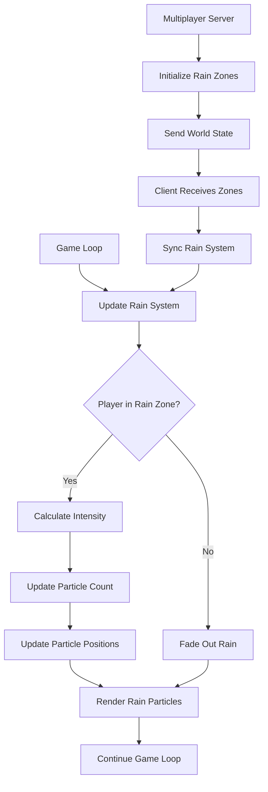

# Design Document: Localized Rain Effects

## Overview

This design implements a localized weather system for the game, starting with rain effects that occur in specific geographical zones. The system will render realistic rain particle effects when the player enters designated rain zones, with smooth fade-in/fade-out transitions. The design prioritizes performance, multiplayer synchronization, and extensibility for future weather types.

The rain system integrates into the existing LibGDX rendering pipeline and works seamlessly in both single-player and multiplayer modes. In multiplayer, rain zones are defined by the server and synchronized to all clients, ensuring consistent environmental experiences.

## Architecture

### High-Level Component Structure

```
MyGdxGame (Main Game Loop)
    ├── RainSystem (Weather Management)
    │   ├── RainZoneManager (Zone Definitions & Distance Calculations)
    │   │   └── List<RainZone> (Zone Data)
    │   └── RainRenderer (Particle Rendering)
    │       └── RainParticlePool (Particle Object Pool)
    └── WorldState (Multiplayer Synchronization)
        └── List<RainZone> (Synchronized Zone Data)
```

### Component Responsibilities

1. **RainSystem**: Main facade that coordinates rain zone management and rendering
2. **RainZoneManager**: Manages rain zone definitions and determines if player is in a rain zone
3. **RainRenderer**: Handles particle generation, animation, and rendering
4. **RainParticlePool**: Object pool for efficient particle reuse
5. **RainZone**: Data class representing a geographical rain area
6. **WorldState**: Extended to include rain zone data for multiplayer synchronization

## Components and Interfaces

### 1. RainZone (Data Class)

```java
package wagemaker.uk.weather;

import java.io.Serializable;

/**
 * Represents a geographical area where rain occurs.
 * Serializable for network transmission in multiplayer mode.
 */
public class RainZone implements Serializable {
    private static final long serialVersionUID = 1L;
    
    private String zoneId;        // Unique identifier
    private float centerX;        // World X coordinate of zone center
    private float centerY;        // World Y coordinate of zone center
    private float radius;         // Radius in pixels
    private float fadeDistance;   // Distance over which rain fades (default: 100px)
    private float intensity;      // Rain intensity 0.0-1.0 (affects particle count)
    
    // Constructors, getters, setters
    // Distance calculation method
    public float getDistanceFrom(float x, float y);
    public float getIntensityAt(float x, float y); // Returns 0.0-1.0 based on distance
}
```

### 2. RainZoneManager

```java
package wagemaker.uk.weather;

import java.util.ArrayList;
import java.util.List;

/**
 * Manages rain zone definitions and determines active zones based on player position.
 */
public class RainZoneManager {
    private List<RainZone> rainZones;
    
    public RainZoneManager();
    
    // Zone management
    public void addRainZone(RainZone zone);
    public void removeRainZone(String zoneId);
    public void clearAllZones();
    public void setRainZones(List<RainZone> zones); // For multiplayer sync
    
    // Query methods
    public boolean isInRainZone(float playerX, float playerY);
    public float getRainIntensityAt(float playerX, float playerY);
    public RainZone getNearestRainZone(float playerX, float playerY);
    
    // Initialization
    public void initializeDefaultZones(); // Creates spawn area rain zone
}
```

### 3. RainParticle (Pooled Object)

```java
package wagemaker.uk.weather;

/**
 * Represents a single rain particle (raindrop).
 * Designed for object pooling to minimize garbage collection.
 */
public class RainParticle {
    private float x;              // Current X position
    private float y;              // Current Y position
    private float velocityY;      // Falling speed (pixels/second)
    private float length;         // Visual length of raindrop
    private float alpha;          // Transparency (0.0-1.0)
    private boolean active;       // Whether particle is currently in use
    
    public void reset(float startX, float startY, float velocity, float length);
    public void update(float deltaTime);
    public boolean isOffScreen(float screenBottom);
    
    // Getters and setters
}
```

### 4. RainRenderer

```java
package wagemaker.uk.weather;

import com.badlogic.gdx.graphics.OrthographicCamera;
import com.badlogic.gdx.graphics.glutils.ShapeRenderer;
import java.util.ArrayList;
import java.util.List;
import java.util.Random;

/**
 * Handles rendering of rain particles using LibGDX ShapeRenderer.
 * Uses object pooling for performance.
 */
public class RainRenderer {
    private static final int MAX_PARTICLES = 200;
    private static final int MIN_PARTICLES = 100;
    private static final float PARTICLE_WIDTH = 2.0f;
    private static final float MIN_PARTICLE_LENGTH = 10.0f;
    private static final float MAX_PARTICLE_LENGTH = 15.0f;
    private static final float MIN_VELOCITY = 400.0f;
    private static final float MAX_VELOCITY = 600.0f;
    
    private List<RainParticle> particlePool;
    private ShapeRenderer shapeRenderer;
    private Random random;
    private float currentIntensity; // 0.0-1.0, affects active particle count
    
    public RainRenderer(ShapeRenderer shapeRenderer);
    
    // Lifecycle methods
    public void initialize();
    public void update(float deltaTime, OrthographicCamera camera, float intensity);
    public void render(OrthographicCamera camera);
    public void dispose();
    
    // Internal methods
    private void spawnParticle(OrthographicCamera camera);
    private void updateParticles(float deltaTime, OrthographicCamera camera);
    private int getTargetParticleCount(float intensity);
}
```

### 5. RainSystem (Main Facade)

```java
package wagemaker.uk.weather;

import com.badlogic.gdx.graphics.OrthographicCamera;
import com.badlogic.gdx.graphics.glutils.ShapeRenderer;

/**
 * Main weather system facade that coordinates rain zones and rendering.
 * Integrates with MyGdxGame's render loop.
 */
public class RainSystem {
    private RainZoneManager zoneManager;
    private RainRenderer renderer;
    private boolean enabled;
    
    public RainSystem(ShapeRenderer shapeRenderer);
    
    // Lifecycle
    public void initialize();
    public void update(float deltaTime, float playerX, float playerY, OrthographicCamera camera);
    public void render(OrthographicCamera camera);
    public void dispose();
    
    // Configuration
    public void setEnabled(boolean enabled);
    public RainZoneManager getZoneManager();
    
    // Multiplayer support
    public void syncRainZones(List<RainZone> zones);
}
```

### 6. WorldState Extension

```java
// Add to existing WorldState.java

private List<RainZone> rainZones;

public List<RainZone> getRainZones() {
    return rainZones;
}

public void setRainZones(List<RainZone> rainZones) {
    this.rainZones = rainZones;
}

// In constructor or initialization:
private void initializeRainZones() {
    this.rainZones = new ArrayList<>();
    // Add spawn area rain zone
    RainZone spawnRain = new RainZone("spawn_rain", 128, 128, 640, 100, 1.0f);
    this.rainZones.add(spawnRain);
}
```

## Data Models

### RainZone Properties

| Property | Type | Description | Default |
|----------|------|-------------|---------|
| zoneId | String | Unique identifier | Required |
| centerX | float | World X coordinate | Required |
| centerY | float | World Y coordinate | Required |
| radius | float | Full intensity radius (pixels) | Required |
| fadeDistance | float | Fade zone distance (pixels) | 100 |
| intensity | float | Max rain intensity (0.0-1.0) | 1.0 |

### RainParticle Properties

| Property | Type | Description | Range |
|----------|------|-------------|-------|
| x | float | Current X position | Screen width |
| y | float | Current Y position | Screen height |
| velocityY | float | Falling speed | 400-600 px/s |
| length | float | Visual length | 10-15 pixels |
| alpha | float | Transparency | 0.3-0.6 |
| active | boolean | In use flag | true/false |

## Integration with Existing Systems

### MyGdxGame Integration

```java
// In MyGdxGame.java

public class MyGdxGame extends ApplicationAdapter {
    // ... existing fields ...
    private RainSystem rainSystem;
    
    @Override
    public void create() {
        // ... existing initialization ...
        
        // Initialize rain system
        rainSystem = new RainSystem(shapeRenderer);
        rainSystem.initialize();
        
        // In multiplayer mode, sync rain zones from server
        if (gameMode != GameMode.SINGLEPLAYER) {
            // Rain zones will be synced when WorldState is received
        } else {
            // Single-player: use default zones
            rainSystem.getZoneManager().initializeDefaultZones();
        }
    }
    
    @Override
    public void render() {
        // ... existing render code ...
        
        // Update rain system (before rendering)
        if (!gameMenu.isAnyMenuOpen()) {
            float playerCenterX = player.getX() + 32;
            float playerCenterY = player.getY() + 32;
            rainSystem.update(deltaTime, playerCenterX, playerCenterY, camera);
        }
        
        // ... existing rendering (grass, trees, players) ...
        
        batch.end();
        
        // Render rain AFTER batch.end() but BEFORE UI
        rainSystem.render(camera);
        
        // ... UI rendering ...
    }
    
    @Override
    public void dispose() {
        // ... existing disposal ...
        rainSystem.dispose();
    }
}
```

### Multiplayer Synchronization

```java
// In GameServer.java - when initializing world state

private void initializeWorldState() {
    worldState = new WorldState(worldSeed);
    
    // Initialize rain zones
    List<RainZone> rainZones = new ArrayList<>();
    rainZones.add(new RainZone("spawn_rain", 128, 128, 640, 100, 1.0f));
    worldState.setRainZones(rainZones);
}

// In GameClient.java - when receiving world state

private void handleWorldState(WorldStateMessage message) {
    WorldState state = message.getWorldState();
    
    // ... existing world state handling ...
    
    // Sync rain zones
    if (state.getRainZones() != null) {
        gameInstance.getRainSystem().syncRainZones(state.getRainZones());
    }
}
```

## Rendering Pipeline

### Render Order (Z-Index)

1. Grass background (existing)
2. Trees and objects (existing)
3. Players (existing)
4. **Rain particles (NEW)** ← Rendered here
5. UI elements (existing)

### Rain Rendering Process

```
1. Check if player is in or near any rain zone
2. Calculate rain intensity based on distance
3. Update particle count to match intensity
4. Update particle positions (falling animation)
5. Render particles using ShapeRenderer
   - Set projection matrix to camera
   - Begin ShapeRenderer (ShapeType.Filled)
   - For each active particle:
     - Set color with alpha based on intensity
     - Draw rectangle (2px wide, 10-15px tall)
   - End ShapeRenderer
```

### Performance Optimizations

1. **Object Pooling**: Reuse RainParticle objects instead of creating new ones
2. **Culling**: Only update/render particles within camera view
3. **Intensity-Based Scaling**: Reduce particle count when at edge of rain zone
4. **Batch Rendering**: Use ShapeRenderer's batched drawing
5. **Early Exit**: Skip all rain processing when player is far from any zone

## Error Handling

### Potential Issues and Solutions

| Issue | Detection | Solution |
|-------|-----------|----------|
| Performance drop | FPS monitoring | Reduce max particle count dynamically |
| Null camera reference | Null check | Skip rendering, log warning |
| Invalid rain zone data | Validation on load | Use default values, log error |
| Multiplayer desync | Zone count mismatch | Re-request world state |
| Memory leak | Particle count growth | Enforce MAX_PARTICLES limit |

### Validation Rules

```java
// RainZone validation
public boolean isValid() {
    return zoneId != null && !zoneId.isEmpty()
        && radius > 0
        && fadeDistance >= 0
        && intensity >= 0.0f && intensity <= 1.0f;
}
```

## Testing Strategy

### Unit Tests

1. **RainZone Distance Calculations**
   - Test Euclidean distance formula
   - Test intensity calculation at various distances
   - Test edge cases (exactly at radius, exactly at fade boundary)

2. **RainZoneManager**
   - Test zone addition/removal
   - Test isInRainZone with multiple zones
   - Test intensity calculation with overlapping zones

3. **RainParticle Pool**
   - Test particle reuse
   - Test pool exhaustion handling
   - Test particle reset functionality

### Integration Tests

1. **Single-Player Rain Rendering**
   - Verify rain appears at spawn area
   - Verify rain fades when walking away
   - Verify performance (60 FPS maintained)

2. **Multiplayer Synchronization**
   - Verify rain zones sync from server
   - Verify all clients see rain in same locations
   - Verify rain zones persist across reconnection

### Manual Testing Checklist

- [ ] Rain appears when standing at spawn (128, 128)
- [ ] Rain fades smoothly when walking away from cactus
- [ ] Rain disappears completely beyond fade distance
- [ ] Rain particles animate smoothly (falling motion)
- [ ] Rain renders above trees but below UI
- [ ] Performance remains at 60 FPS with rain active
- [ ] Multiplayer: Rain zones sync correctly
- [ ] Multiplayer: All clients see rain in same locations
- [ ] Rain system can be disabled/enabled at runtime

## Future Extensibility

### Adding New Weather Types

The architecture supports future weather types through abstraction:

```java
// Future interface for weather effects
public interface WeatherEffect {
    void update(float deltaTime, float playerX, float playerY, OrthographicCamera camera);
    void render(OrthographicCamera camera);
    void setIntensity(float intensity);
    void dispose();
}

// RainRenderer would implement WeatherEffect
// Future: SnowRenderer, FogRenderer, etc.
```

### Adding New Rain Zones

```java
// Easy zone addition
RainZone forestRain = new RainZone("forest_rain", 2000, 1500, 800, 150, 0.8f);
rainSystem.getZoneManager().addRainZone(forestRain);
```

### Dynamic Weather

Future enhancement: Weather zones that change over time

```java
// Future: Time-based weather
public class DynamicRainZone extends RainZone {
    private float duration;
    private float elapsedTime;
    
    public void update(float deltaTime) {
        elapsedTime += deltaTime;
        if (elapsedTime >= duration) {
            // Deactivate or change intensity
        }
    }
}
```

## Performance Considerations

### Target Metrics

- **Frame Rate**: Maintain 60 FPS with rain active
- **Particle Count**: 100-200 particles maximum
- **Memory**: < 1MB for rain system (particle pool + textures)
- **CPU**: < 5% additional CPU usage for rain rendering

### Optimization Techniques

1. **Spatial Partitioning**: Only check nearest rain zone first
2. **Update Frequency**: Update particle positions at 60Hz, but check zone distance at 10Hz
3. **LOD System**: Reduce particle count when player is moving fast
4. **Culling**: Don't update particles outside camera view + buffer

### Memory Management

```java
// Pre-allocate particle pool at initialization
private void initializeParticlePool() {
    particlePool = new ArrayList<>(MAX_PARTICLES);
    for (int i = 0; i < MAX_PARTICLES; i++) {
        particlePool.add(new RainParticle());
    }
}

// Reuse particles instead of creating new ones
private RainParticle getInactiveParticle() {
    for (RainParticle particle : particlePool) {
        if (!particle.isActive()) {
            return particle;
        }
    }
    return null; // Pool exhausted
}
```

## Configuration

### Tunable Parameters

```java
// RainRenderer configuration constants
public class RainConfig {
    // Particle counts
    public static final int MAX_PARTICLES = 200;
    public static final int MIN_PARTICLES = 100;
    
    // Visual properties
    public static final float PARTICLE_WIDTH = 2.0f;
    public static final float MIN_PARTICLE_LENGTH = 10.0f;
    public static final float MAX_PARTICLE_LENGTH = 15.0f;
    public static final float MIN_ALPHA = 0.3f;
    public static final float MAX_ALPHA = 0.6f;
    
    // Physics
    public static final float MIN_VELOCITY = 400.0f;
    public static final float MAX_VELOCITY = 600.0f;
    public static final float WIND_EFFECT = 0.0f; // Future: horizontal drift
    
    // Zone defaults
    public static final float DEFAULT_FADE_DISTANCE = 100.0f;
    public static final float DEFAULT_INTENSITY = 1.0f;
}
```

## Diagram: Rain System Flow



## Summary

This design provides a performant, extensible rain system that integrates seamlessly with the existing game architecture. The modular design separates concerns (zone management, particle rendering, multiplayer sync) and uses proven techniques like object pooling for optimal performance. The system is ready for future expansion to support additional weather types and dynamic weather patterns.
