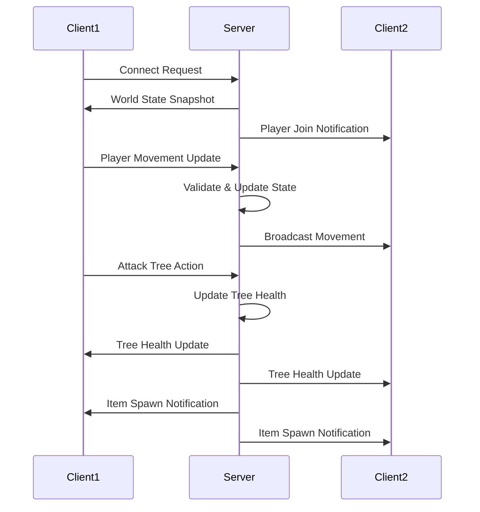

# Multiplayer Networking Design Document

## Overview

The multiplayer networking system will transform the Woodlanders game from a single-player experience into a shared multiplayer world using a client-server architecture. The design leverages Java's built-in networking capabilities with a custom protocol for efficient game state synchronization. The server maintains authoritative game state while clients handle rendering and input, with optimistic client-side prediction to ensure responsive gameplay despite network latency.

### Key Design Principles

1. **Server Authority**: The server is the single source of truth for all game state
2. **Efficient Synchronization**: Only changed state is transmitted to minimize bandwidth
3. **Client Prediction**: Local player movement is rendered immediately for responsiveness
4. **Deterministic World Generation**: All clients generate identical worlds using shared seeds
5. **Graceful Degradation**: The game remains playable with network issues

## Architecture

### High-Level Architecture

```
┌─────────────────┐         ┌─────────────────┐         ┌─────────────────┐
│   Game Client   │◄───────►│   Game Server   │◄───────►│   Game Client   │
│   (Player 1)    │  TCP    │  (Authoritative │  TCP    │   (Player 2)    │
│                 │         │   Game State)   │         │                 │
└─────────────────┘         └─────────────────┘         └─────────────────┘
        │                           │                           │
        │                           │                           │
        ▼                           ▼                           ▼
┌─────────────────┐         ┌─────────────────┐         ┌─────────────────┐
│  Local Render   │         │  World State    │         │  Local Render   │
│  & Input        │         │  Manager        │         │  & Input        │
└─────────────────┘         └─────────────────┘         └─────────────────┘
```

### Network Layer Architecture

```
Application Layer (Game Logic)
        ↕
Message Protocol Layer (Serialization/Deserialization)
        ↕
Transport Layer (TCP Sockets)
        ↕
Network Layer (IP)
```

### Component Interaction Flow



## Components and Interfaces

### 1. Network Package (`wagemaker.uk.network`)

#### 1.1 GameServer Class

**Responsibility**: Manages server lifecycle, client connections, and authoritative game state

**Key Methods**:
```java
public class GameServer {
    // Server lifecycle
    public void start(int port) throws IOException
    public void stop()
    public boolean isRunning()
    
    // Client management
    private void acceptClients()
    private void handleClientConnection(Socket clientSocket)
    private void disconnectClient(String clientId)
    
    // State management
    public WorldState getWorldState()
    public void updateWorldState(WorldStateUpdate update)
    
    // Broadcasting
    private void broadcastToAll(NetworkMessage message)
    private void broadcastToAllExcept(NetworkMessage message, String excludeClientId)
    
    // Utility
    public String getPublicIPv4()
}
```

**State**:
- `ServerSocket serverSocket`: Listens for incoming connections
- `Map<String, ClientConnection> connectedClients`: Active client sessions
- `WorldState worldState`: Authoritative game state
- `ExecutorService clientThreadPool`: Handles concurrent client connections
- `boolean running`: Server status flag
- `int port`: Server port (default 25565)

#### 1.2 GameClient Class

**Responsibility**: Manages client connection to server and handles incoming state updates

**Key Methods**:
```java
public class GameClient {
    // Connection management
    public void connect(String serverAddress, int port) throws IOException
    public void disconnect()
    public boolean isConnected()
    
    // Message handling
    public void sendMessage(NetworkMessage message)
    private void receiveMessages()
    private void handleMessage(NetworkMessage message)
    
    // State synchronization
    public void requestWorldState()
    public void updateLocalState(WorldStateUpdate update)
    
    // Player actions
    public void sendPlayerMovement(float x, float y, Direction direction)
    public void sendAttackAction(String targetId)
    public void sendItemPickup(String itemId)
}
```

**State**:
- `Socket socket`: Connection to server
- `ObjectInputStream inputStream`: Receives messages
- `ObjectOutputStream outputStream`: Sends messages
- `Thread receiveThread`: Listens for incoming messages
- `MessageHandler messageHandler`: Processes received messages
- `String clientId`: Unique client identifier
- `boolean connected`: Connection status

#### 1.3 NetworkMessage Class (Abstract)

**Responsibility**: Base class for all network messages with serialization support

**Subclasses**:
- `PlayerMovementMessage`: Player position and direction updates
- `PlayerJoinMessage`: New player connection notification
- `PlayerLeaveMessage`: Player disconnection notification
- `WorldStateMessage`: Complete world state snapshot
- `WorldStateUpdateMessage`: Incremental state changes
- `TreeHealthUpdateMessage`: Tree damage updates
- `TreeDestroyedMessage`: Tree destruction notification
- `ItemSpawnMessage`: Dropped item creation
- `ItemPickupMessage`: Item collection request/confirmation
- `PlayerHealthUpdateMessage`: Player health changes
- `AttackActionMessage`: Player attack action
- `ConnectionAcceptedMessage`: Server accepts client connection
- `ConnectionRejectedMessage`: Server rejects client connection

**Structure**:
```java
public abstract class NetworkMessage implements Serializable {
    private static final long serialVersionUID = 1L;
    protected long timestamp;
    protected String senderId;
    
    public abstract MessageType getType();
    public long getTimestamp()
    public String getSenderId()
}
```

#### 1.4 WorldState Class

**Responsibility**: Represents the complete authoritative game state

**Structure**:
```java
public class WorldState implements Serializable {
    private long worldSeed;
    private Map<String, PlayerState> players;
    private Map<String, TreeState> trees;
    private Map<String, ItemState> items;
    private Set<String> clearedPositions;
    
    // Synchronization methods
    public WorldStateUpdate getDeltaSince(long timestamp)
    public void applyUpdate(WorldStateUpdate update)
    public WorldState createSnapshot()
}
```

**Sub-classes**:
```java
public class PlayerState implements Serializable {
    String playerId;
    String playerName;
    float x, y;
    Direction direction;
    float health;
    boolean isMoving;
    long lastUpdateTime;
}

public class TreeState implements Serializable {
    String treeId;
    TreeType type;
    float x, y;
    float health;
    boolean exists;
}

public class ItemState implements Serializable {
    String itemId;
    ItemType type;
    float x, y;
    boolean collected;
}
```

#### 1.5 ClientConnection Class

**Responsibility**: Manages individual client connection on server side

**Structure**:
```java
public class ClientConnection {
    private Socket socket;
    private ObjectInputStream input;
    private ObjectOutputStream output;
    private String clientId;
    private PlayerState playerState;
    private Thread receiveThread;
    private long lastHeartbeat;
    
    public void sendMessage(NetworkMessage message)
    public void close()
    public boolean isAlive()
}
```

### 2. Multiplayer UI Package (`wagemaker.uk.ui.multiplayer`)

#### 2.1 MultiplayerMenu Class

**Responsibility**: Main multiplayer menu interface

**Key Methods**:
```java
public class MultiplayerMenu {
    public void render(SpriteBatch batch, ShapeRenderer shapeRenderer, 
                      float camX, float camY, float viewWidth, float viewHeight)
    public void update()
    public void handleInput()
    public boolean isOpen()
    public void open()
    public void close()
}
```

**State**:
- `Texture woodenPlank`: Menu background texture
- `BitmapFont menuFont`: Text rendering font
- `String[] menuOptions`: ["Host Server", "Connect to Server", "Back"]
- `int selectedIndex`: Currently selected menu item
- `boolean isOpen`: Menu visibility state

#### 2.2 ServerHostDialog Class

**Responsibility**: Displays server IP address after hosting

**Key Methods**:
```java
public class ServerHostDialog {
    public void show(String ipAddress)
    public void render(SpriteBatch batch, ShapeRenderer shapeRenderer,
                      float camX, float camY)
    public void handleInput()
    public boolean isVisible()
}
```

#### 2.3 ConnectDialog Class

**Responsibility**: IP address input for connecting to servers

**Key Methods**:
```java
public class ConnectDialog {
    public void show()
    public void render(SpriteBatch batch, ShapeRenderer shapeRenderer,
                      float camX, float camY)
    public void handleInput()
    public String getEnteredAddress()
    public boolean isConfirmed()
}
```

**State**:
- `String inputBuffer`: Current IP address input
- `boolean confirmed`: User confirmed input
- `Texture woodenPlank`: Dialog background

### 3. Modified Existing Components

#### 3.1 MyGdxGame Modifications

**New Fields**:
```java
private GameMode gameMode; // SINGLEPLAYER, MULTIPLAYER_HOST, MULTIPLAYER_CLIENT
private GameServer gameServer; // Only for host mode
private GameClient gameClient; // For multiplayer modes
private Map<String, RemotePlayer> remotePlayers; // Other players in multiplayer
private MultiplayerMenu multiplayerMenu;
```

**New Methods**:
```java
public void startMultiplayerHost()
public void joinMultiplayerServer(String address, int port)
public void syncWorldState(WorldState state)
private void renderRemotePlayers()
```

#### 3.2 Player Modifications

**New Fields**:
```java
private String playerId; // Unique identifier for multiplayer
private GameClient gameClient; // Reference for sending updates
```

**Modified Methods**:
```java
// Send position updates to server in multiplayer mode
public void update(float deltaTime) {
    // ... existing code ...
    if (gameClient != null && gameClient.isConnected()) {
        gameClient.sendPlayerMovement(x, y, currentDirection);
    }
}

// Send attack actions to server
private void attackNearbyTrees() {
    // ... existing code ...
    if (gameClient != null && gameClient.isConnected()) {
        gameClient.sendAttackAction(targetKey);
    }
}
```

#### 3.3 New RemotePlayer Class

**Responsibility**: Represents other players in multiplayer sessions

**Structure**:
```java
public class RemotePlayer {
    private String playerId;
    private String playerName;
    private float x, y;
    private Direction currentDirection;
    private float health;
    private boolean isMoving;
    private Animation<TextureRegion> currentAnimation;
    private float animTime;
    
    public void updatePosition(float x, float y, Direction direction, boolean moving)
    public void updateHealth(float health)
    public void render(SpriteBatch batch)
    public void renderHealthBar(ShapeRenderer shapeRenderer)
    public void renderNameTag(SpriteBatch batch, BitmapFont font)
}
```

### 4. Server Launcher Package (`wagemaker.uk.server`)

#### 4.1 DedicatedServerLauncher Class

**Responsibility**: Standalone server executable

**Structure**:
```java
public class DedicatedServerLauncher {
    public static void main(String[] args) {
        int port = parsePort(args);
        GameServer server = new GameServer();
        
        try {
            server.start(port);
            System.out.println("Server started on port: " + port);
            System.out.println("Public IP: " + server.getPublicIPv4());
            
            // Keep server running
            while (server.isRunning()) {
                Thread.sleep(100);
            }
        } catch (Exception e) {
            System.err.println("Server error: " + e.getMessage());
        }
    }
    
    private static int parsePort(String[] args)
    private static void setupShutdownHook(GameServer server)
}
```

## Data Models

### Message Protocol Format

All messages are serialized using Java's ObjectOutputStream/ObjectInputStream for simplicity. Each message includes:

1. **Message Type** (enum): Identifies the message purpose
2. **Timestamp** (long): When the message was created
3. **Sender ID** (String): Client identifier
4. **Payload** (varies): Message-specific data

### World Synchronization Strategy

**Initial Connection**:
1. Client connects to server
2. Server sends complete WorldState snapshot
3. Client applies snapshot and generates world
4. Server broadcasts PlayerJoinMessage to other clients

**Ongoing Updates**:
1. Clients send actions (movement, attacks, pickups)
2. Server validates and updates authoritative state
3. Server broadcasts state changes to all clients
4. Clients apply updates to local state

**Delta Updates**:
- Only changed entities are transmitted
- Each update includes timestamp for ordering
- Clients track last received timestamp to detect gaps

### Deterministic World Generation

The server generates a random seed on startup and shares it with all clients. All clients use this seed for:
- Tree placement (using position-based seeding)
- Grass texture generation
- Cactus initial position

This ensures all clients see identical worlds without transmitting every tree position.

## Error Handling

### Connection Failures

**Client-Side**:
- Display error dialog with retry option
- Return to multiplayer menu
- Log error details for debugging

**Server-Side**:
- Log connection attempt and failure reason
- Continue accepting other connections
- Send rejection message if server is full

### Network Interruptions

**Heartbeat System**:
- Clients send heartbeat every 5 seconds
- Server tracks last heartbeat time
- Disconnect clients with >15 second timeout

**Reconnection**:
- Client detects disconnection
- Attempt automatic reconnection (3 attempts)
- If failed, return to main menu with notification

### State Desynchronization

**Detection**:
- Server validates all client actions
- Reject impossible actions (teleportation, invalid attacks)
- Send correction messages to clients

**Recovery**:
- Client receives correction message
- Smoothly interpolate to corrected position
- Log desync event for debugging

### Message Loss

**TCP Reliability**:
- TCP guarantees message delivery and ordering
- No custom acknowledgment system needed
- Connection loss triggers reconnection logic

## Testing Strategy

### Unit Tests

**Network Layer**:
- Message serialization/deserialization
- WorldState delta calculation
- Client connection management
- Server broadcasting logic

**Game Logic**:
- Attack validation
- Item pickup validation
- Position validation
- Health calculation

### Integration Tests

**Client-Server Communication**:
- Connect/disconnect flow
- World state synchronization
- Player movement replication
- Tree destruction synchronization
- Item spawn and pickup flow

**Multi-Client Scenarios**:
- Two clients connecting simultaneously
- One client disconnecting while others remain
- Multiple clients attacking same tree
- Multiple clients picking up same item (race condition)

### Performance Tests

**Load Testing**:
- Server with 10 concurrent clients
- Measure message throughput
- Monitor memory usage
- Test bandwidth consumption

**Latency Testing**:
- Simulate 50ms, 100ms, 200ms, 500ms latency
- Verify client prediction smoothness
- Test position correction behavior

### Manual Testing

**Gameplay Testing**:
- Host server and connect from another machine
- Verify all player actions replicate correctly
- Test menu navigation and UI
- Verify visual consistency across clients
- Test edge cases (rapid movement, spam attacks)

**Network Conditions**:
- Test on local network (LAN)
- Test over internet with real latency
- Test with packet loss simulation
- Test reconnection after network interruption

## Security Considerations

### Input Validation

- Server validates all position updates (max speed check)
- Server validates attack range before applying damage
- Server validates item pickup distance
- Reject malformed messages

### Denial of Service Protection

- Rate limit messages per client (100 messages/second)
- Limit maximum connected clients (configurable, default 20)
- Timeout idle connections (15 seconds)
- Validate message sizes (max 64KB per message)

### Authentication (Future Enhancement)

Current design has no authentication. Future versions should add:
- Player account system
- Password-protected servers
- Ban/kick functionality
- Admin privileges

## Performance Optimizations

### Bandwidth Optimization

1. **Delta Updates**: Only send changed state
2. **Position Quantization**: Round positions to nearest pixel
3. **Update Throttling**: Limit position updates to 20/second
4. **Interest Management**: Only send updates for nearby entities

### Server Performance

1. **Thread Pool**: Reuse threads for client connections
2. **Non-Blocking I/O**: Consider NIO for high client counts
3. **State Caching**: Cache frequently accessed state
4. **Spatial Partitioning**: Use grid for efficient entity queries

### Client Performance

1. **Object Pooling**: Reuse RemotePlayer objects
2. **Interpolation**: Smooth remote player movement
3. **Culling**: Don't render off-screen remote players
4. **Lazy Loading**: Load remote player textures on demand

## Configuration

### Server Configuration File (server.properties)

```properties
# Server port
server.port=25565

# Maximum connected clients
server.max-clients=20

# World seed (0 = random)
world.seed=0

# Heartbeat interval (seconds)
server.heartbeat-interval=5

# Client timeout (seconds)
server.client-timeout=15

# Message rate limit (messages/second)
server.rate-limit=100

# Enable debug logging
server.debug=false
```

### Client Configuration

Stored in existing game menu system:
- Last connected server address
- Player name (already implemented)
- Preferred port

## Deployment

### Server Deployment

**Standalone JAR**:
```bash
gradle serverJar
java -jar build/libs/woodlanders-server.jar --port 25565
```

**Docker Container** (Future):
```dockerfile
FROM openjdk:21-slim
COPY build/libs/woodlanders-server.jar /app/server.jar
EXPOSE 25565
CMD ["java", "-jar", "/app/server.jar"]
```

### Client Deployment

No changes to existing client deployment. Multiplayer is an optional feature accessed through the menu.

## Migration Path

### Phase 1: Core Networking
- Implement basic client-server connection
- Implement message protocol
- Implement world state synchronization

### Phase 2: Player Synchronization
- Replicate player movement
- Replicate player animations
- Display remote player name tags

### Phase 3: World Interaction
- Synchronize tree attacks and destruction
- Synchronize item spawns and pickups
- Synchronize player health

### Phase 4: UI and Polish
- Implement multiplayer menu
- Implement server host dialog
- Implement connect dialog
- Add connection status indicators

### Phase 5: Standalone Server
- Implement dedicated server launcher
- Add server configuration file
- Add server logging and monitoring

## Future Enhancements

1. **Voice Chat**: Integrate voice communication
2. **Chat System**: Text-based player communication
3. **Player Trading**: Exchange items between players
4. **PvP Combat**: Player vs player damage
5. **Persistent Worlds**: Save/load multiplayer worlds
6. **Server Browser**: Discover public servers
7. **Mod Support**: Allow custom server modifications
8. **Anti-Cheat**: Detect and prevent cheating
