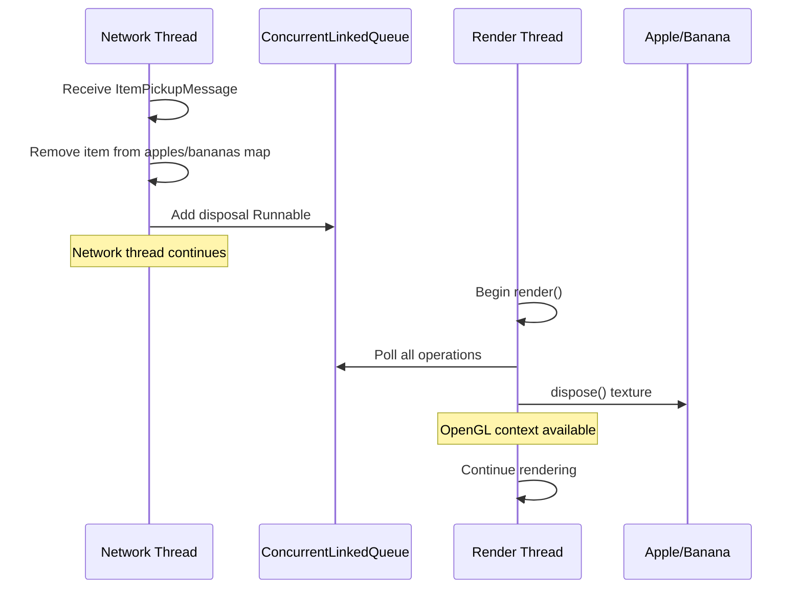

# Multiplayer Threading Fix Design Document

## Overview

This design document addresses a critical threading bug in the Woodlanders multiplayer system where OpenGL texture disposal operations are incorrectly called from the network receive thread, causing client crashes. The solution implements a deferred operation queue that allows network message handlers to schedule OpenGL operations for execution on the main render thread, ensuring thread safety while maintaining responsive gameplay.

### Root Cause Analysis

The crash occurs with the following sequence:

1. Player destroys an AppleTree or BananaTree in multiplayer
2. Server broadcasts item spawn message to all clients
3. Player picks up the spawned item (Apple or Banana)
4. Server broadcasts item pickup message to all clients
5. **GameClient-Receive thread** receives the pickup message
6. Message handler calls `game.removeItem(itemId)`
7. `removeItem()` calls `banana.dispose()` or `apple.dispose()`
8. `dispose()` calls `texture.dispose()` which calls OpenGL's `glDeleteTextures()`
9. **CRASH**: OpenGL operations can only be called from the render thread

### Key Design Principles

1. **Thread Safety**: All OpenGL operations must execute on the render thread
2. **Non-Blocking**: Network thread must not block waiting for render thread
3. **Immediate State Updates**: Game state updates happen immediately, only resource disposal is deferred
4. **Minimal Changes**: Leverage existing concurrent queue pattern already in MyGdxGame
5. **Extensibility**: Solution applies to all future OpenGL operations from network messages

## Architecture

### Threading Model

```
┌─────────────────────────────────────────────────────────────┐
│                     Render Thread (Main)                     │
│  ┌────────────────────────────────────────────────────────┐ │
│  │  render() {                                            │ │
│  │    1. Process pendingDeferredOperations queue         │ │
│  │    2. Update game state                               │ │
│  │    3. Render frame                                    │ │
│  │  }                                                     │ │
│  └────────────────────────────────────────────────────────┘ │
│                            ▲                                 │
│                            │ Executes operations             │
│                            │                                 │
└────────────────────────────┼─────────────────────────────────┘
                             │
                             │
┌────────────────────────────┼─────────────────────────────────┐
│                  Network Thread (GameClient-Receive)         │
│  ┌────────────────────────┼──────────────────────────────┐  │
│  │  handleItemPickup() {  │                              │  │
│  │    1. Update game state immediately (remove from map)│  │
│  │    2. Queue disposal operation ──────────────────────┘  │
│  │  }                                                       │
│  └──────────────────────────────────────────────────────────┘
└─────────────────────────────────────────────────────────────┘
```

### Component Interaction



## Components and Interfaces

### 1. Deferred Operation Queue

**Location**: `MyGdxGame.java`

**New Field**:
```java
// Queue for operations that must execute on the render thread
private java.util.concurrent.ConcurrentLinkedQueue<Runnable> pendingDeferredOperations;
```

**Initialization** (in `create()` method):
```java
pendingDeferredOperations = new java.util.concurrent.ConcurrentLinkedQueue<>();
```

**Processing** (at start of `render()` method):
```java
// Process all pending deferred operations (must run on render thread)
Runnable operation;
while ((operation = pendingDeferredOperations.poll()) != null) {
    try {
        operation.run();
    } catch (Exception e) {
        System.err.println("Error executing deferred operation: " + e.getMessage());
        e.printStackTrace();
    }
}
```

### 2. Modified MyGdxGame.removeItem()

**Current Implementation** (UNSAFE):
```java
public void removeItem(String itemId) {
    Apple apple = apples.remove(itemId);
    if (apple != null) {
        apple.dispose();  // ❌ CRASHES if called from network thread
        return;
    }
    
    Banana banana = bananas.remove(itemId);
    if (banana != null) {
        banana.dispose();  // ❌ CRASHES if called from network thread
    }
}
```

**New Implementation** (SAFE):
```java
/**
 * Removes an item from the game world.
 * This method is thread-safe and can be called from network threads.
 * The item is immediately removed from the game state, but texture disposal
 * is deferred to the render thread.
 * 
 * @param itemId The unique identifier of the item to remove
 */
public void removeItem(String itemId) {
    // Immediately remove from game state (thread-safe map operations)
    Apple apple = apples.remove(itemId);
    if (apple != null) {
        // Defer texture disposal to render thread
        deferOperation(() -> apple.dispose());
        return;
    }
    
    Banana banana = bananas.remove(itemId);
    if (banana != null) {
        // Defer texture disposal to render thread
        deferOperation(() -> banana.dispose());
    }
}
```

### 3. New Helper Method: deferOperation()

**Location**: `MyGdxGame.java`

**Implementation**:
```java
/**
 * Defers an operation to be executed on the render thread.
 * This is necessary for operations that require OpenGL context access,
 * such as texture disposal, which cannot be performed from network threads.
 * 
 * @param operation The operation to execute on the render thread
 */
public void deferOperation(Runnable operation) {
    if (operation == null) {
        return;
    }
    
    pendingDeferredOperations.add(operation);
    
    // Optional: Log for debugging
    if (Gdx.app.getLogLevel() >= com.badlogic.gdx.Application.LOG_DEBUG) {
        System.out.println("[DEBUG] Deferred operation queued. Queue size: " + 
                          pendingDeferredOperations.size());
    }
    
    // Optional: Warn if queue is getting large
    if (pendingDeferredOperations.size() > 100) {
        System.err.println("[WARNING] Deferred operation queue size exceeds 100. " +
                          "Possible memory leak or render thread stall.");
    }
}
```

### 4. Thread Safety Analysis

**ConcurrentLinkedQueue Properties**:
- Lock-free implementation using CAS (Compare-And-Swap)
- Thread-safe for concurrent add() and poll() operations
- No blocking or waiting
- Suitable for producer-consumer pattern between network and render threads

**Map Operations**:
- `apples.remove(itemId)` and `bananas.remove(itemId)` are atomic operations
- HashMap is not thread-safe, but in this case:
  - Only network thread removes items
  - Only render thread adds items (via updateItemFromState)
  - No concurrent modification of same key
  - Acceptable risk given single-threaded access patterns

**Future Enhancement** (if needed):
```java
// Replace HashMap with ConcurrentHashMap for full thread safety
private Map<String, Apple> apples = new java.util.concurrent.ConcurrentHashMap<>();
private Map<String, Banana> bananas = new java.util.concurrent.ConcurrentHashMap<>();
```

## Data Models

### Deferred Operation

**Type**: `Runnable` (Java standard interface)

**Examples**:

1. **Item Disposal**:
```java
() -> apple.dispose()
```

2. **Remote Player Cleanup**:
```java
() -> remotePlayer.dispose()
```

3. **Tree Texture Disposal** (if needed in future):
```java
() -> tree.disposeTextures()
```

### Operation Queue Characteristics

- **Capacity**: Unbounded (ConcurrentLinkedQueue)
- **Ordering**: FIFO (First-In-First-Out)
- **Performance**: O(1) for add and poll operations
- **Memory**: Each Runnable is a small lambda closure (~100 bytes)

## Error Handling

### Disposal Failures

**Scenario**: Texture disposal throws exception

**Handling**:
```java
try {
    operation.run();
} catch (Exception e) {
    System.err.println("Error executing deferred operation: " + e.getMessage());
    e.printStackTrace();
    // Continue processing other operations
}
```

**Rationale**: One failed disposal should not prevent other operations from executing

### Queue Overflow

**Detection**:
```java
if (pendingDeferredOperations.size() > 100) {
    System.err.println("[WARNING] Deferred operation queue size exceeds 100.");
}
```

**Possible Causes**:
1. Render thread stalled or frozen
2. Network thread receiving messages faster than render can process
3. Memory leak in operation closures

**Mitigation**:
- Log warning for investigation
- Continue operation (queue is unbounded)
- Monitor in production for patterns

### Null Safety

**Check in deferOperation()**:
```java
if (operation == null) {
    return;
}
```

**Rationale**: Prevent NullPointerException from being queued

## Testing Strategy

### Unit Tests

**Test 1: Deferred Operation Execution**
```java
@Test
public void testDeferredOperationExecutes() {
    MyGdxGame game = new MyGdxGame();
    game.create();
    
    AtomicBoolean executed = new AtomicBoolean(false);
    game.deferOperation(() -> executed.set(true));
    
    // Simulate render loop
    game.render();
    
    assertTrue(executed.get());
}
```

**Test 2: Multiple Operations Processed**
```java
@Test
public void testMultipleDeferredOperations() {
    MyGdxGame game = new MyGdxGame();
    game.create();
    
    List<Integer> executionOrder = new ArrayList<>();
    game.deferOperation(() -> executionOrder.add(1));
    game.deferOperation(() -> executionOrder.add(2));
    game.deferOperation(() -> executionOrder.add(3));
    
    game.render();
    
    assertEquals(Arrays.asList(1, 2, 3), executionOrder);
}
```

**Test 3: Exception Handling**
```java
@Test
public void testDeferredOperationExceptionHandling() {
    MyGdxGame game = new MyGdxGame();
    game.create();
    
    AtomicBoolean secondExecuted = new AtomicBoolean(false);
    game.deferOperation(() -> { throw new RuntimeException("Test exception"); });
    game.deferOperation(() -> secondExecuted.set(true));
    
    game.render(); // Should not crash
    
    assertTrue(secondExecuted.get()); // Second operation should still execute
}
```

### Integration Tests

**Test 4: Item Pickup in Multiplayer**
```java
@Test
public void testMultiplayerItemPickupDoesNotCrash() {
    // Setup: Create game in multiplayer mode
    MyGdxGame game = new MyGdxGame();
    game.create();
    game.joinMultiplayerServer("localhost", 25565);
    
    // Simulate item spawn
    ItemState itemState = new ItemState("banana1", ItemType.BANANA, 100, 100, false);
    game.updateItemFromState(itemState);
    
    // Simulate item pickup from network thread
    Thread networkThread = new Thread(() -> {
        game.removeItem("banana1");
    });
    networkThread.start();
    networkThread.join();
    
    // Render should process disposal without crashing
    game.render();
    
    // Verify item is removed
    assertNull(game.getBananas().get("banana1"));
}
```

**Test 5: Rapid Item Pickups**
```java
@Test
public void testRapidItemPickups() {
    MyGdxGame game = new MyGdxGame();
    game.create();
    
    // Spawn 10 items
    for (int i = 0; i < 10; i++) {
        ItemState item = new ItemState("banana" + i, ItemType.BANANA, i * 10, i * 10, false);
        game.updateItemFromState(item);
    }
    
    // Remove all items from network thread
    Thread networkThread = new Thread(() -> {
        for (int i = 0; i < 10; i++) {
            game.removeItem("banana" + i);
        }
    });
    networkThread.start();
    networkThread.join();
    
    // Process all disposals
    game.render();
    
    // Verify all items removed
    assertEquals(0, game.getBananas().size());
}
```

### Manual Testing

**Test Scenario 1: AppleTree Destruction**
1. Start server: `java -jar woodlanders-server.jar`
2. Connect two clients
3. Player 1 destroys an AppleTree
4. Player 2 picks up the apple
5. **Expected**: No crash, apple disappears for both players

**Test Scenario 2: BananaTree Destruction**
1. Start server
2. Connect two clients
3. Player 1 destroys a BananaTree
4. Player 1 picks up the banana
5. **Expected**: No crash, banana disappears for both players

**Test Scenario 3: Rapid Pickups**
1. Start server
2. Connect two clients
3. Destroy multiple AppleTrees and BananaTrees
4. Both players rapidly pick up items
5. **Expected**: No crashes, smooth gameplay

**Test Scenario 4: Cross-Platform**
1. Run server on Linux
2. Connect Windows client and Linux client
3. Destroy AppleTree/BananaTree
4. Pick up items
5. **Expected**: Both clients remain stable

## Performance Considerations

### Overhead Analysis

**Per-Frame Overhead**:
- Queue polling: O(n) where n = operations queued since last frame
- Typical n: 0-5 operations per frame
- Cost: ~1-10 microseconds (negligible)

**Memory Overhead**:
- Each lambda closure: ~100 bytes
- Typical queue size: 0-10 operations
- Total: <1 KB (negligible)

**Latency Impact**:
- Item removal from game state: Immediate (same frame as message received)
- Texture disposal: Deferred to next render frame (~16ms at 60 FPS)
- Visual impact: None (item already removed from rendering)

### Optimization Opportunities

**Batch Disposal** (future enhancement):
```java
// Instead of disposing textures individually, batch them
List<Texture> texturesToDispose = new ArrayList<>();
deferOperation(() -> {
    for (Texture texture : texturesToDispose) {
        texture.dispose();
    }
    texturesToDispose.clear();
});
```

**Texture Pooling** (future enhancement):
```java
// Reuse textures instead of disposing
TexturePool pool = new TexturePool();
deferOperation(() -> pool.returnTexture(texture));
```

## Migration Path

### Phase 1: Core Fix (This Spec)
- Add `pendingDeferredOperations` queue
- Add `deferOperation()` helper method
- Modify `removeItem()` to defer disposal
- Add operation processing to `render()`

### Phase 2: Comprehensive Application
- Apply pattern to RemotePlayer disposal
- Apply pattern to tree texture disposal (if needed)
- Apply pattern to any future OpenGL operations from network

### Phase 3: Monitoring and Optimization
- Add metrics for queue size over time
- Add metrics for operation execution time
- Optimize if performance issues detected

## Alternative Solutions Considered

### Alternative 1: Synchronize on Render Thread

**Approach**: Use locks to ensure disposal only happens when render thread is idle

**Rejected Because**:
- Complex synchronization logic
- Risk of deadlocks
- Performance overhead of locking
- Violates OpenGL threading model

### Alternative 2: Post Runnable to LibGDX

**Approach**: Use `Gdx.app.postRunnable()`

**Rejected Because**:
- LibGDX's postRunnable is designed for different use case
- Less control over execution timing
- Existing pattern in codebase uses ConcurrentLinkedQueue
- Consistency with existing code is valuable

### Alternative 3: Dispose on Network Thread with Context Sharing

**Approach**: Create shared OpenGL context for network thread

**Rejected Because**:
- Complex platform-specific setup
- Not supported on all platforms
- Overkill for this problem
- Maintenance burden

## Security Considerations

### Denial of Service

**Attack Vector**: Malicious server sends rapid item pickup messages to overflow queue

**Mitigation**:
- Queue size warning at 100 operations
- Unbounded queue prevents crash (trades memory for stability)
- Rate limiting on server side (already implemented)

**Future Enhancement**:
- Add maximum queue size with oldest operation eviction
- Add metrics to detect abnormal patterns

### Resource Exhaustion

**Scenario**: Memory leak in lambda closures

**Mitigation**:
- Lambdas capture only necessary references (item object)
- Items are removed from maps before disposal
- No circular references
- Queue is drained every frame

## Documentation

### Code Comments

**deferOperation() Method**:
```java
/**
 * Defers an operation to be executed on the render thread.
 * This is necessary for operations that require OpenGL context access,
 * such as texture disposal, which cannot be performed from network threads.
 * 
 * Thread Safety: This method is thread-safe and can be called from any thread.
 * The operation will be executed on the next render frame.
 * 
 * @param operation The operation to execute on the render thread
 */
```

**removeItem() Method**:
```java
/**
 * Removes an item from the game world.
 * This method is thread-safe and can be called from network threads.
 * The item is immediately removed from the game state, but texture disposal
 * is deferred to the render thread to avoid OpenGL threading violations.
 * 
 * @param itemId The unique identifier of the item to remove
 */
```

### Developer Guide Addition

**Section: Multiplayer Threading Guidelines**

When implementing network message handlers that interact with game resources:

1. **Immediate State Updates**: Update game state (maps, lists) immediately in the message handler
2. **Defer OpenGL Operations**: Use `deferOperation()` for any OpenGL calls (texture disposal, shader operations, etc.)
3. **Thread Safety**: Use thread-safe collections or ensure single-threaded access patterns
4. **Testing**: Always test multiplayer features with multiple clients to catch threading issues

**Example**:
```java
// ✅ CORRECT
public void handleItemPickup(ItemPickupMessage message) {
    Apple apple = apples.remove(message.getItemId());  // Immediate state update
    if (apple != null) {
        deferOperation(() -> apple.dispose());  // Deferred OpenGL operation
    }
}

// ❌ INCORRECT
public void handleItemPickup(ItemPickupMessage message) {
    Apple apple = apples.remove(message.getItemId());
    if (apple != null) {
        apple.dispose();  // CRASH: OpenGL call from network thread
    }
}
```

## Future Enhancements

1. **Metrics Dashboard**: Track queue size, operation count, execution time
2. **Texture Pooling**: Reuse textures instead of disposing
3. **Batch Operations**: Group multiple disposals into single operation
4. **Thread Affinity Checking**: Assert operations run on correct thread in debug mode
5. **Operation Prioritization**: Process critical operations before others

## Conclusion

This design provides a minimal, safe, and performant solution to the multiplayer threading crash. By leveraging Java's ConcurrentLinkedQueue and deferring only OpenGL operations to the render thread, we maintain responsive gameplay while ensuring thread safety. The solution is extensible to future features and follows established patterns in the codebase.
