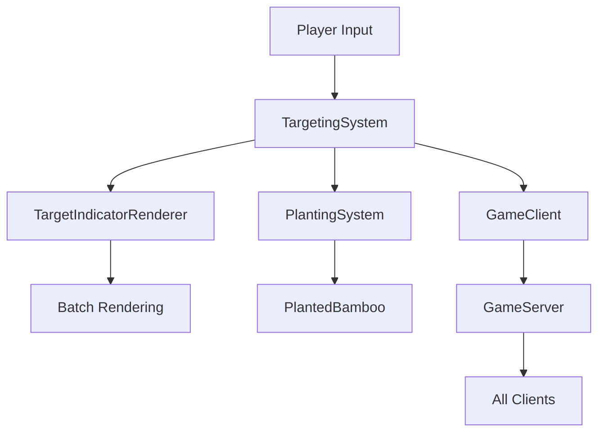
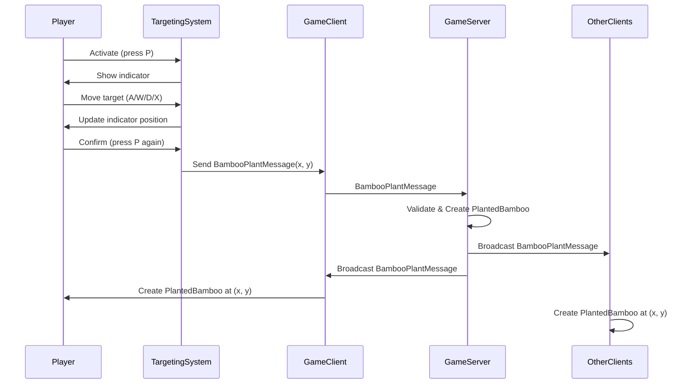

# Design Document

## Overview

The Tile Targeting System is a client-side input and visual feedback system that allows players to select adjacent tiles for position-based actions. The initial implementation focuses on bamboo planting, but the architecture is designed to be extensible for future features like projectile targeting, area-of-effect abilities, and other position-based interactions.

The system operates entirely on the client side until an action is confirmed, at which point the selected coordinates are transmitted to the server (in multiplayer) or applied locally (in single-player). This approach ensures responsive UI feedback while maintaining server authority over game state.

## Architecture

### Component Diagram



### Key Components

1. **TargetingSystem**: Core logic for managing targeting mode, processing directional input, and validating target positions
2. **TargetIndicatorRenderer**: Renders the visual indicator (dot) at the selected tile position
3. **Player**: Modified to integrate targeting mode activation and input delegation
4. **PlantingSystem**: Modified to accept explicit tile coordinates instead of player position
5. **GameClient/GameServer**: Modified to transmit target coordinates in planting messages

### Integration Points

- **Player.update()**: Checks for targeting mode activation and delegates input to TargetingSystem
- **Player.handlePlantingAction()**: Modified to use TargetingSystem coordinates
- **MyGdxGame.render()**: Renders target indicator after terrain but before entities
- **BambooPlantMessage**: Already supports explicit coordinates (no changes needed)

## Components and Interfaces

### TargetingSystem Class

```java
package wagemaker.uk.targeting;

public class TargetingSystem {
    // State
    private boolean isActive;
    private float targetX;
    private float targetY;
    private float playerX;
    private float playerY;
    private TargetingMode mode;
    private TargetingCallback callback;
    
    // Configuration
    private int maxRange; // For future ranged targeting
    
    /**
     * Activate targeting mode at the player's current position.
     * @param playerX Player's current x coordinate
     * @param playerY Player's current y coordinate
     * @param mode Targeting mode (ADJACENT, RANGED, etc.)
     * @param callback Callback to invoke when target is confirmed
     */
    public void activate(float playerX, float playerY, TargetingMode mode, TargetingCallback callback);
    
    /**
     * Deactivate targeting mode and clear state.
     */
    public void deactivate();
    
    /**
     * Process directional input to move the target cursor.
     * @param direction Direction to move (UP, DOWN, LEFT, RIGHT)
     */
    public void moveTarget(Direction direction);
    
    /**
     * Confirm the current target selection.
     * Invokes the callback with the selected coordinates.
     */
    public void confirmTarget();
    
    /**
     * Get the current target tile coordinates.
     * @return float array [x, y] in world coordinates (tile-aligned)
     */
    public float[] getTargetCoordinates();
    
    /**
     * Check if targeting mode is currently active.
     */
    public boolean isActive();
    
    /**
     * Update method for any time-based logic (future use).
     */
    public void update(float deltaTime);
}
```

### TargetingMode Enum

```java
package wagemaker.uk.targeting;

public enum TargetingMode {
    ADJACENT,  // Only adjacent tiles (current implementation)
    RANGED,    // Tiles within a range (future)
    LINE,      // Tiles in a line (future)
    AREA       // Area of effect (future)
}
```

### Direction Enum

```java
package wagemaker.uk.targeting;

public enum Direction {
    UP,
    DOWN,
    LEFT,
    RIGHT
}
```

### TargetingCallback Interface

```java
package wagemaker.uk.targeting;

public interface TargetingCallback {
    /**
     * Called when the player confirms a target selection.
     * @param targetX The selected tile's x coordinate
     * @param targetY The selected tile's y coordinate
     */
    void onTargetConfirmed(float targetX, float targetY);
    
    /**
     * Called when targeting is cancelled.
     */
    void onTargetCancelled();
}
```

### TargetIndicatorRenderer Class

```java
package wagemaker.uk.targeting;

import com.badlogic.gdx.graphics.Texture;
import com.badlogic.gdx.graphics.g2d.SpriteBatch;

public class TargetIndicatorRenderer {
    private Texture indicatorTexture;
    private float indicatorSize;
    
    /**
     * Initialize the renderer with a visual indicator.
     */
    public void initialize();
    
    /**
     * Render the target indicator at the specified position.
     * @param batch SpriteBatch for rendering
     * @param x World x coordinate
     * @param y World y coordinate
     */
    public void render(SpriteBatch batch, float x, float y);
    
    /**
     * Dispose of graphics resources.
     */
    public void dispose();
}
```

## Data Models

### Targeting State

The TargetingSystem maintains the following state:

- **isActive** (boolean): Whether targeting mode is currently active
- **targetX** (float): Current target tile x coordinate (tile-aligned, 64px grid)
- **targetY** (float): Current target tile y coordinate (tile-aligned, 64px grid)
- **playerX** (float): Player's position when targeting was activated
- **playerY** (float): Player's position when targeting was activated
- **mode** (TargetingMode): Current targeting mode
- **callback** (TargetingCallback): Callback to invoke on confirmation

### Visual Indicator

The target indicator is a simple circular dot texture:
- **Size**: 16x16 pixels (centered on 64x64 tile)
- **Color**: Semi-transparent white (RGBA: 1.0, 1.0, 1.0, 0.7)
- **Position**: Centered on the target tile (targetX + 24, targetY + 24)

## Error Handling

### Invalid Target Selection

When the player attempts to move the target to an invalid position:
1. **Out of range**: Target movement is ignored (no visual feedback)
2. **Invalid tile type**: Confirmation is blocked, visual feedback shows red indicator
3. **Occupied tile**: Confirmation is blocked, visual feedback shows red indicator

### Network Errors

In multiplayer mode, if the planting message fails to send:
1. Client-side state is rolled back (item returned to inventory)
2. Error notification is displayed to the player
3. Targeting mode remains active for retry

### Mode Conflicts

If targeting mode is activated while already active:
1. Previous targeting session is cancelled
2. New targeting session starts at current player position
3. Previous callback receives onTargetCancelled()

## Testing Strategy

### Unit Tests

1. **TargetingSystem State Management**
   - Test activation/deactivation
   - Test target movement in all directions
   - Test coordinate snapping to tile grid
   - Test mode transitions

2. **Input Handling**
   - Test directional key processing
   - Test confirmation key processing
   - Test cancellation key processing
   - Test input filtering when inactive

3. **Callback Invocation**
   - Test callback on confirmation
   - Test callback on cancellation
   - Test callback with various coordinate values

### Integration Tests

1. **Planting Integration**
   - Test bamboo planting with targeting system
   - Test inventory deduction after confirmation
   - Test planted bamboo appears at target coordinates
   - Test targeting mode deactivates after planting

2. **Multiplayer Synchronization**
   - Test target indicator is client-side only
   - Test planted bamboo appears for all clients
   - Test coordinates match across clients
   - Test server validation of target coordinates

3. **Single-Player vs Multiplayer**
   - Test identical behavior in both modes
   - Test direct application in single-player
   - Test server-mediated application in multiplayer

### Manual Testing

1. **Visual Feedback**
   - Verify indicator appears at correct position
   - Verify indicator moves smoothly with input
   - Verify indicator is not visible to other players
   - Verify indicator color changes for invalid tiles

2. **Input Responsiveness**
   - Verify input lag is minimal (<16ms)
   - Verify no input conflicts with movement
   - Verify targeting keys only work in targeting mode

3. **Edge Cases**
   - Test targeting at world boundaries
   - Test targeting with no baby bamboo in inventory
   - Test targeting on various biome types
   - Test targeting on occupied tiles

## Implementation Details

### Input Key Mapping

The targeting system uses the following key bindings:
- **A**: Move target left (Input.Keys.A)
- **W**: Move target up (Input.Keys.W)
- **D**: Move target right (Input.Keys.D)
- **X**: Move target down (Input.Keys.X)
- **P**: Confirm target and execute action (Input.Keys.P)
- **ESC**: Cancel targeting mode (Input.Keys.ESCAPE)

### Activation Trigger

Targeting mode is activated when:
1. Player presses "P" key
2. Baby bamboo is selected in inventory (slot 2)
3. Player has at least 1 baby bamboo in inventory

### Tile Grid Alignment

All target coordinates are snapped to the 64x64 tile grid:
```java
float snapToTileGrid(float coordinate) {
    return (float) (Math.floor(coordinate / 64.0) * 64.0);
}
```

### Rendering Order

The target indicator is rendered in the following order:
1. Terrain (grass/sand/snow)
2. **Target Indicator** ← Inserted here
3. Planted bamboos
4. Respawn indicators
5. Trees and resources
6. Players
7. UI elements

### Multiplayer Message Flow



### Performance Considerations

1. **Input Polling**: Targeting input is polled once per frame in Player.update()
2. **Rendering**: Target indicator is a single texture draw (minimal overhead)
3. **Network Traffic**: Only one message sent per planting action (no continuous updates)
4. **Memory**: TargetingSystem maintains minimal state (~40 bytes)

### Extensibility Design

The system is designed for future extensions:

1. **Ranged Targeting**: Add maxRange parameter and range validation
2. **Projectile Targeting**: Use same indicator with different callback
3. **Area Targeting**: Add area size parameter and render multiple indicators
4. **Custom Indicators**: Pass Texture to TargetIndicatorRenderer constructor
5. **Validation Rules**: Add ValidationStrategy interface for custom validation

Example future usage:
```java
// Projectile targeting with 5-tile range
targetingSystem.activate(
    playerX, playerY,
    TargetingMode.RANGED,
    (x, y) -> fireProjectile(x, y)
);
targetingSystem.setMaxRange(5 * 64); // 5 tiles
```

## Design Decisions and Rationales

### Client-Side Targeting

**Decision**: Targeting indicator and input processing are entirely client-side.

**Rationale**: 
- Provides instant visual feedback without network latency
- Reduces network traffic (only final coordinates are sent)
- Maintains responsive UI even with high ping
- Server still validates final action for security

### Tile-Aligned Coordinates

**Decision**: All target coordinates are snapped to 64x64 tile grid.

**Rationale**:
- Consistent with existing game grid system
- Simplifies collision detection and validation
- Matches planted bamboo positioning logic
- Prevents sub-tile positioning issues

### Separate Targeting Keys

**Decision**: Use A/W/D/X for targeting instead of arrow keys.

**Rationale**:
- Arrow keys are used for player movement
- Allows player to remain stationary while targeting
- Prevents accidental movement during targeting
- Familiar WASD-style layout (rotated for left hand)

### Callback-Based Architecture

**Decision**: Use callback interface instead of direct coupling.

**Rationale**:
- Decouples targeting system from specific actions
- Enables reuse for different action types
- Simplifies testing with mock callbacks
- Supports future action types without modification

### Single Active Target

**Decision**: Only one target can be active at a time per player.

**Rationale**:
- Simplifies UI and input handling
- Matches current single-action gameplay pattern
- Reduces cognitive load on player
- Can be extended to multi-target in future if needed
