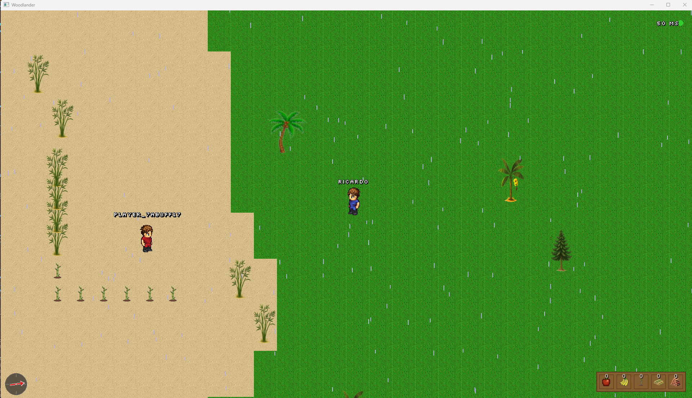

# Woodlanders - A 2D Multiplayer Adventure

## 🎮 The AI-Driven Game Development Story

**Woodlanders** is an ambitious experiment in AI-assisted game development - a fully functional multiplayer 2D adventure game built entirely through conversational AI within the **Kiro IDE**. This project demonstrates what's possible when human creativity meets AI capabilities: no manual coding, just natural language prompts, specifications, and iterative refinement.

### The Vision: Zero-Code Game Development

The goal was simple yet audacious: **build a complete, enjoyable multiplayer game in Java using only AI prompts and requests**. No direct code writing. No manual debugging. Just describing what we wanted, and letting Kiro AI bring it to life.

[](https://github.com/gcclinux/Woodlanders/issues)
[](https://github.com/gcclinux/Woodlanders/discussions)
[](https://www.buymeacoffee.com/gcclinux)
[](https://kiro.dev/)
[](https://github.com/sponsors/gcclinux)

<div align="center">

### Farming Bamboo

*Farming Baoom with rain, inventory, trees, items, sand, compas, ping*

</div>

### 📸 [More Woodland Screenshots](./SCREENSHOTS.md)

### The Kiro Contains: Two Powerful Approaches

**Kiro AI Vibe** and **Kiro Spec** are two complementary ways to work with AI in the Kiro IDE:

**🌊 Kiro AI Vibe** - *Conversational Flow Development*
- Natural, chat-based interaction with the AI
- Perfect for rapid prototyping and exploratory development
- Immediate responses to "add this feature" or "fix that bug"
- Ideal for quick iterations, bug fixes, and feature additions
- Think of it as pair programming with an AI that never gets tired

**📋 Kiro Spec** - *Structured Feature Engineering*
- Formalized design and implementation process
- Break down complex features into requirements, design, and tasks
- Incremental development with control and feedback at each stage
- Perfect for large features requiring careful planning
- References external files (OpenAPI specs, GraphQL schemas) for context
- Think of it as having an AI project manager and developer in one

### The Journey: From Concept to Playable Game

Starting with a simple idea - "create a 2D adventure game" - we used:
- **Kiro AI Vibe** for rapid feature additions: player movement, tree chopping, health systems
- **Kiro Spec** for complex systems: multiplayer networking, menu systems, world generation
- Pure natural language to describe mechanics: "make trees regenerate health over time"
- Iterative refinement: "the collision feels off" → instant fixes

The result? A feature-rich game with:
- Infinite procedurally generated worlds
- Smooth multiplayer networking
- Combat and resource systems
- Environmental hazards and health mechanics
- Professional menu systems and UI

### What Makes This Special

This isn't just a game - it's proof of concept that complex software can be built through conversation. Every feature, every bug fix, every optimization came from describing what we wanted in plain English. The AI handled the Java, the libGDX framework, the networking protocols, and the game architecture.

**Woodlanders** stands as a testament to the future of software development: where ideas flow directly from mind to machine, and the barrier between imagination and implementation dissolves.

---

## 🎯 Game Overview

A 2D top-down multiplayer adventure game built with libGDX featuring infinite world exploration, animated characters, tree chopping mechanics, and real-time multiplayer gameplay.

### Performance Features
- Chunk-based rendering (only visible areas)
- Optimized collision detection with spatial partitioning
- Efficient network message batching
- Delta-time based animations and physics
- Texture atlas for sprite management
- Memory-efficient world generation

### Network Architecture
- **Protocol**: Custom TCP-based protocol
- **Message Types**: 20+ synchronized message types
- **Synchronization**: Server-authoritative with client prediction
- **Heartbeat**: 5-second keepalive with 15-second timeout
- **Rate Limiting**: Configurable message rate limits per client

## [Installation Guide](INSTALLATION.md)

## Controls

### Movement
- **Arrow Keys** - Move character (Up/Down/Left/Right)
- Character automatically animates based on movement direction

### Actions
- **Spacebar** - Context-sensitive action key:
  - **When no item selected**: Attack nearby trees
  - **When item selected**: Plant item at target location
- **Automatic Pickup** - Items are automatically collected when walking near them (within 32 pixels)

### Targeting System (When Item Selected)
When you select a placeable item (e.g., baby bamboo with key '3'), a white targeting indicator appears:
- **A** - Move target left
- **W** - Move target up
- **D** - Move target right
- **S** - Move target down
- **Spacebar** or **P** - Plant item at current target location
- **ESC** - Cancel targeting
- **Press item key again** - Deselect item and hide targeting indicator

The targeting system stays active as long as an item is selected, allowing you to plant multiple items quickly without reactivating targeting.

### Inventory
- **1-6 Keys** - Select/deselect inventory slots (toggle selection)
  - **1** - Apples (consumable)
  - **2** - Bananas (consumable)
  - **3** - Baby Bamboo (placeable on sand)
  - **4** - Bamboo Stack (resource)
  - **5** - Wood Stack (resource)
  - **6** - Pebbles (resource)
- **Tab** - Toggle inventory display
- Selected items show a yellow highlight box

### Interface
- **Escape** - Open/close game menu

### Menu Navigation
- **Arrow Keys** or **Up/Down** - Navigate menu options
- **Enter** - Select menu option
- **Escape** - Close menu or cancel dialog
- **Backspace** - Delete character in text input
- **Delete** - Remove selected save file (in load menu)

## Menu Navigation

### Main Menu (Press "Esc" in-game)
Access the main menu at any time by pressing the Escape key. The menu adapts based on whether you're in singleplayer or multiplayer mode.

#### Singleplayer Menu Options
```
┌────────────────────────────┐
│   Player Name              │
│   Save World               │
│   Load World               │
│   Multiplayer              │
│   Save Player              │
│   Language                 │
│   Exit                     │
└────────────────────────────┘
```

#### Multiplayer Menu Options
```
┌────────────────────────────┐
│   Player Name              │
│   Save World               │
│   Load World               │
│   Save Player              │
│   Disconnect               │
│   Language                 │
│   Exit                     │
└────────────────────────────┘
```

### Menu Options Explained

**Player Name**
```
┌────────────────────────────┐
│   Enter Player Name        │
│                            │
│   ______________________   │
│                            │
│   Min 3 Characters!!!      │
│   Enter, or Esc to Cancel  │
└────────────────────────────┘
```
*Set your player name (minimum 3 characters, maximum 15 characters). Supports letters, numbers, and spaces. This name is visible to other players in multiplayer mode.*

**Save World**
```
┌────────────────────────────┐
│   Save World               │
│                            │
│   World Name:              │
│   ______________________   │
│                            │
│   Enter to Save            │
│   Esc to Cancel            │
└────────────────────────────┘
```
*Save the complete world state including all trees, items, cleared positions, rain zones, and player data. Separate save directories for singleplayer and multiplayer. Automatically creates backups of existing saves.*

**Load World**
```
┌────────────────────────────┐
│   Load World               │
│                            │
│   > World_1                │
│     World_2                │
│     World_3                │
│                            │
│   Enter to Load            │
│   Delete to Remove         │
│   Esc to Cancel            │
└────────────────────────────┘
```
*Browse and load previously saved worlds. Shows save name, timestamp, and file size. Use arrow keys to navigate, Enter to load, Delete to remove a save.*

**Multiplayer**
```
┌────────────────────────────┐
│   Multiplayer              │
│                            │
│   Host Server              │
│   Connect to Server        │
│                            │
│   Back                     │
└────────────────────────────┘
```
*Access multiplayer options. Host a server for others to join, or connect to an existing server.*

**Multiplayer → Host Server**
```
┌────────────────────────────┐
│   Host Server              │
│                            │
│   Port: 25565              │
│   Max Clients: 20          │
│                            │
│   Enter to Start           │
│   Esc to Cancel            │
└────────────────────────────┘
```
*Start a server on your machine. Configure port and maximum player count. Your public IP will be displayed for others to connect.*

**Multiplayer → Connect to Server**
```
┌────────────────────────────┐
│   Connect to Server        │
│                            │
│   IP Address:              │
│   ______________________   │
│   Port Number:             │
│   ________                 │
│                            │
│   Enter to Connect         │
│   Esc to Cancel            │
└────────────────────────────┘
```
*Connect to a remote server. Enter the server's IP address and port. The game remembers your last server for quick reconnection.*

**Save Player**
*Saves your player data including position, health, inventory, and settings. Separate saves for singleplayer and multiplayer positions. Data is saved to your OS-specific config directory.*

**Language**
```
┌────────────────────────────┐
│   Select Language          │
│                            │
│   > English                │
│     Polski                 │
│     Português              │
│     Nederlands             │
│     German                 │
│                            │
│   Enter to Select          │
│   Esc to Cancel            │
└────────────────────────────┘
```
*Change the game's display language. Supports English, Polish (Polski), Portuguese (Português), and Dutch (Nederlands). All menus, dialogs, and UI text will update immediately. The game automatically detects your system language on first launch.*

**Disconnect** *(Multiplayer only)*
*Disconnect from the current multiplayer server and return to singleplayer mode. Your multiplayer progress is automatically saved.*

**Exit**
*Exit the game. All player data and world state are automatically saved before closing.*

## 🎮 Game Features

For a comprehensive list of all game features, mechanics, and technical details, see **[FEATURES.md](docs/FEATURES.md)**.

### Quick Feature Highlights

#### World & Environment
- ✨ **Infinite Procedurally Generated World** - Explore endlessly with dynamic terrain generation
- 🏜️ **Multiple Biomes** - Grass and sand biomes with distinct visual styles
- �️ ***Dynamic Weather System** - Random rain events that follow the player (120s duration, 2-8 minute intervals)
- 🧭 **Compass Navigation** - Always points toward spawn point for easy navigation
- � **Worldp Save/Load System** - Save and load complete world states with separate singleplayer/multiplayer saves

#### Character & Movement
- 🏃 **Animated Player Character** - Smooth walking animations with directional sprites
- 💚 **Health System** - Player health management with damage and restoration mechanics
- 🎯 **Precise Collision Detection** - Optimized hitboxes for all game objects

#### Trees & Resources
- 🌳 **Multiple Tree Types** - Small trees, regular trees, apple trees, banana trees, bamboo trees, and coconut trees
- ⚔️ **Combat System** - Attack and destroy trees with visual health bars
- 🔄 **Health Regeneration** - Damaged trees slowly recover health over time
- 🌵 **Environmental Hazards** - Cacti that damage players on contact
- 🎋 **Bamboo Planting System** - Plant baby bamboo on sand tiles using the targeting system; grows into harvestable bamboo trees (120s growth time)
- 🎯 **Tile Targeting System** - Visual targeting indicator for precise item placement with WASD controls

#### Inventory & Items
- 🎒 **Inventory System** - Separate inventories for singleplayer and multiplayer modes
- 🍎 **Collectible Items** - Apples, bananas, baby bamboo, bamboo stacks, and wood stacks
- 🍌 **Auto-Consumption** - Items automatically consumed when health is low
- 📦 **Item Drops** - Trees drop resources when destroyed
- 🔄 **Network Sync** - Inventory synchronized across multiplayer sessions

#### Multiplayer
- 🌐 **Dedicated Server** - Standalone server with configurable settings
- 👥 **Real-time Multiplayer** - Synchronized player positions, actions, and world state
- 📡 **Connection Quality Indicator** - Visual network status display
- 💾 **Separate Positions** - Independent player positions for singleplayer and multiplayer
- 🔌 **Disconnect/Reconnect** - Graceful connection handling with last server memory

#### User Interface
- 📋 **In-Game Menu System** - Wooden plank themed menus with ESC key access
- 👤 **Player Name Customization** - Set custom player names (min 3 characters)
- 🖥️ **HUD Elements** - Health bar, inventory display, compass, and connection status
- 💾 **World Management** - Save, load, and manage multiple world saves
- 🎨 **Custom Fonts** - Retro pixel font (slkscr.ttf) for authentic game feel
- 🌍 **Multi-Language Support** - English, Polish (Polski), Portuguese (Português), and Dutch (Nederlands) with auto-detection

##  [Java Classes](CLASSES.md)

## Current Status

### ✅ Completed Features
- **World System**: Infinite procedural generation with multiple biomes (grass, sand)
- **Character System**: Animated player with smooth movement and directional sprites
- **Tree System**: 6 tree types with health, regeneration, and unique collision boxes
- **Combat System**: Attack mechanics with visual health bars and damage feedback
- **Inventory System**: Full inventory with 5 item types and auto-consumption
- **Item System**: Collectible items with health restoration and resource drops
- **Weather System**: Dynamic rain with random events and zone-based rendering
- **Biome System**: Multiple biomes with distinct textures and generation patterns
- **World Persistence**: Complete save/load system with separate SP/MP saves
- **Multiplayer**: Dedicated server with full world and player synchronization
- **UI System**: Comprehensive menu system with wooden plank theme
- **Navigation**: Compass pointing to spawn with dynamic rotation
- **Network**: 22+ message types for complete multiplayer synchronization
- **Server**: Configurable dedicated server with monitoring and logging
- **Health System**: Player health with damage, restoration, and auto-consumption
- **Collision System**: Precise hitboxes for all entities with optimized detection
- **Planting System**: Plant baby bamboo on sand tiles with growth and transformation mechanics
- **Targeting System**: Visual tile-based targeting with WASD movement and persistent indicator while item selected

### 🚧 Future Enhancements
- **Crafting System**: Combine resources to create new items
- **Building System**: Place structures and modify the world
- **Sound Effects**: Audio feedback for actions and events
- **Music System**: Background music and ambient sounds
- **More Biomes**: Desert, forest, snow, and ocean biomes
- **Day/Night Cycle**: Dynamic lighting and time-based events
- **Mob System**: Hostile and friendly creatures
- **Quest System**: Objectives and progression
- **Trading System**: NPC merchants and player trading
- **Skills/Leveling**: Character progression and abilities

### Configuration Directory Locations

Player data and world saves are stored in OS-specific directories:

- **Windows**: `%APPDATA%/Woodlanders/`
- **macOS**: `~/Library/Application Support/Woodlanders/`
- **Linux**: `~/.config/woodlanders/`

Directory structure:
```
Woodlanders/
├── woodlanders.json          # Player config (position, health, inventory, name)
└── world-saves/
    ├── singleplayer/         # Singleplayer world saves
    │   ├── World_1.wld
    │   ├── World_1.wld.backup
    │   └── ...
    └── multiplayer/          # Multiplayer world saves
        ├── Server_1.wld
        ├── Server_1.wld.backup
        └── ...
```

### Resource Respawn Configuration

Resource respawn behavior is configured with hardcoded values in the `RespawnConfig.java` class:

- **Default respawn time**: 15 minutes (900,000 ms)
- **Visual indicator threshold**: 1 minute (60,000 ms) before respawn
- **Visual indicators**: Enabled by default

To customize respawn durations, modify the constants in `src/main/java/wagemaker/uk/respawn/RespawnConfig.java` and recompile the game.

### 🚀 [Woodland Documentation](./docs/README.md)

### Universal LPC Spritesheet Character Generator

[Universal LPC Spritesheet Character Generator](https://liberatedpixelcup.github.io/Universal-LPC-Spritesheet-Character-Generator/#?body=Body_color_amber&head=Human_male_amber&sex=male&nose=Straight_nose_amber&eyebrows=Thin_Eyebrows_chestnut&hair=Messy1_light_brown&clothes=Shortsleeve_Polo_navy&legs=Long_Pants_navy&shoes=Revised_Boots_black)

