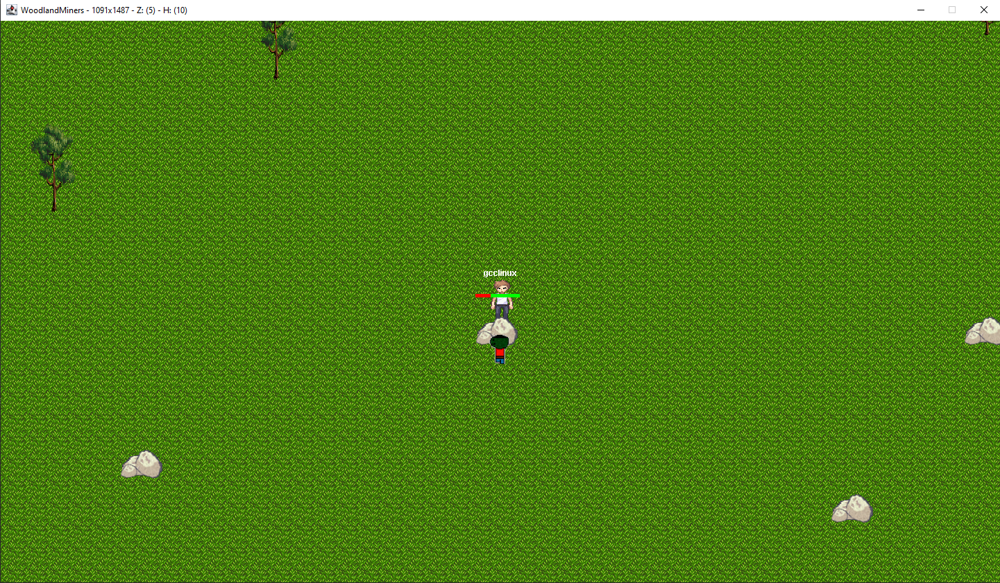
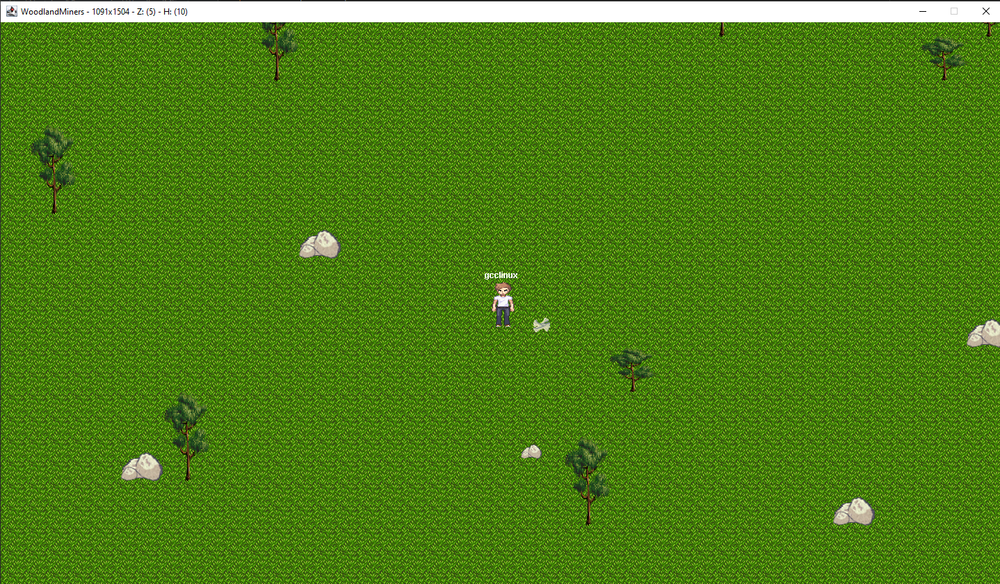
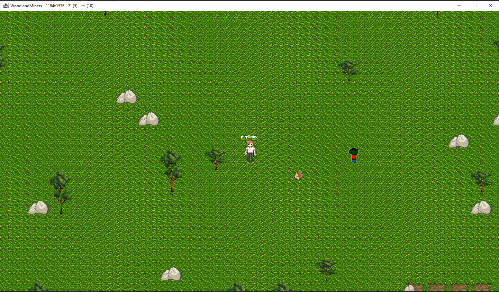
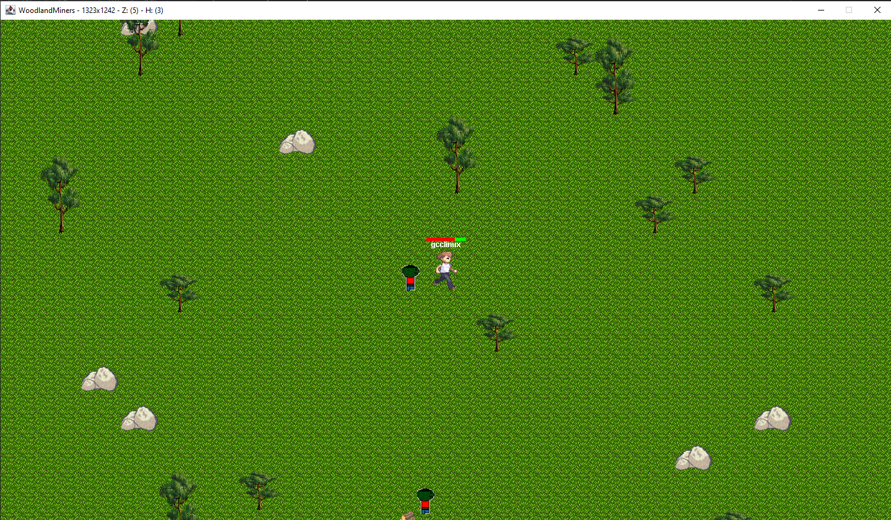
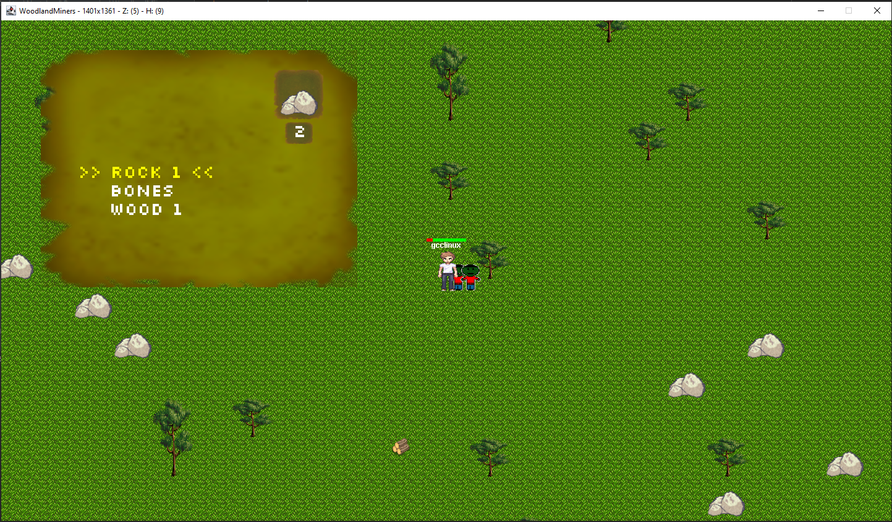
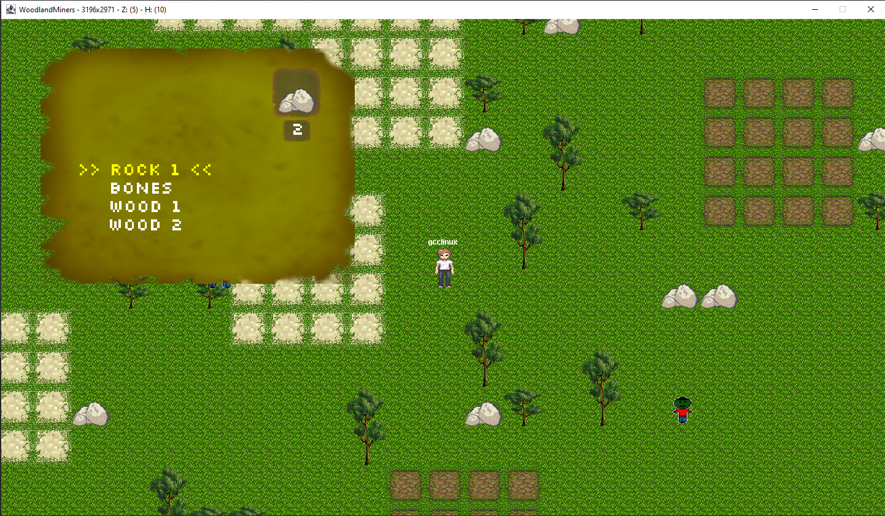
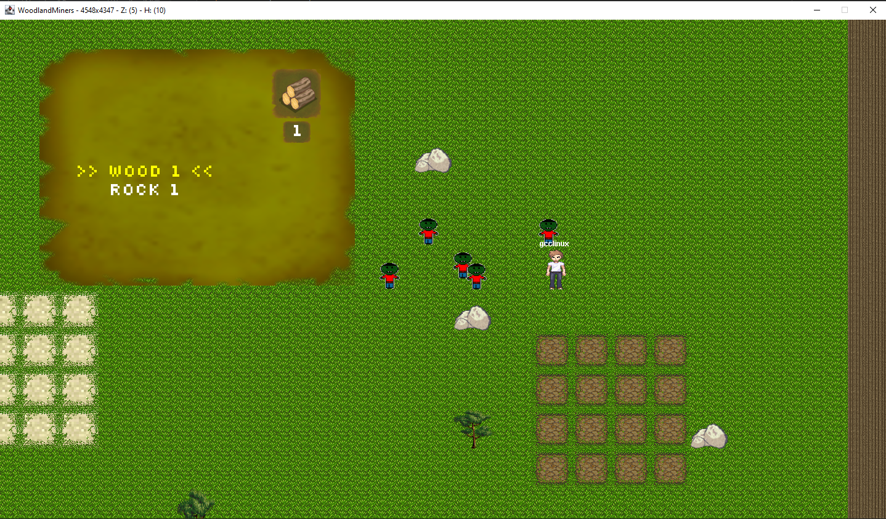

# woodlandminers
2D Java game mining stone, bones and wood to create weapons against zombies

This project has not been developed since 2016 and not finished, I am hoping that at some point I'll do more and finish it, but feel free to contribute

**TODO**

* Better character graphics
* Save items collected in a local db
* create work bench to craft weapons / items
* create more collectable items
* create progression levels
* create map levels

Those are just a few items that was on my todo list and hoping to continue this one day.

