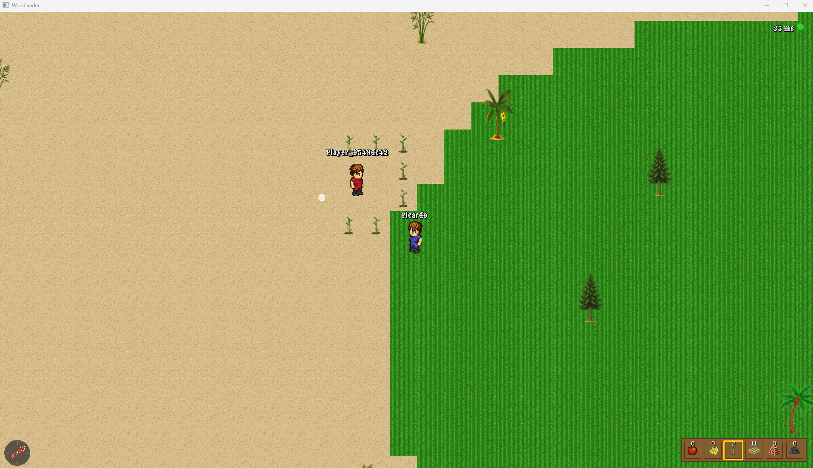
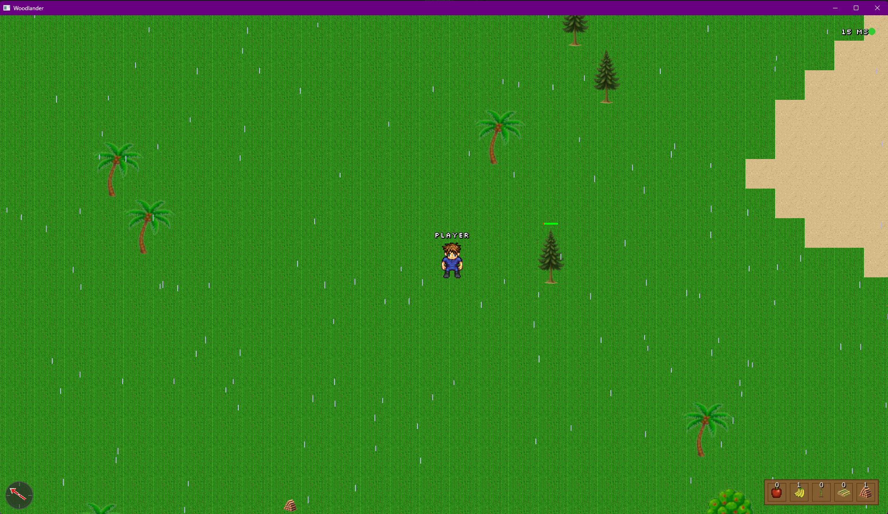
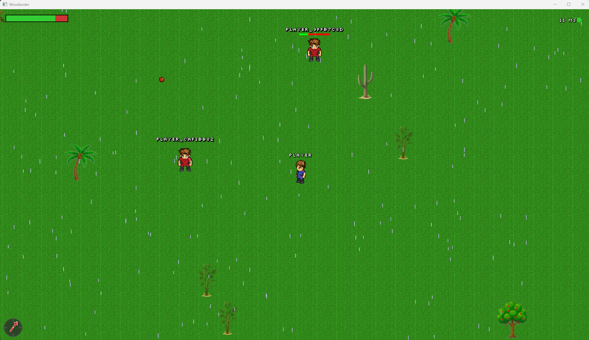
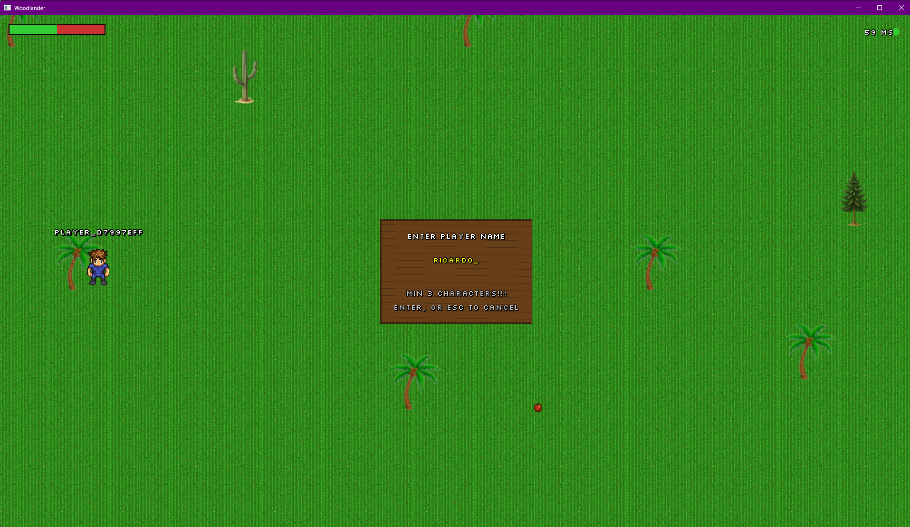
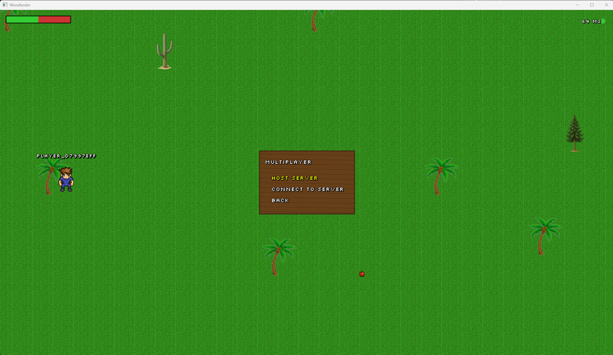
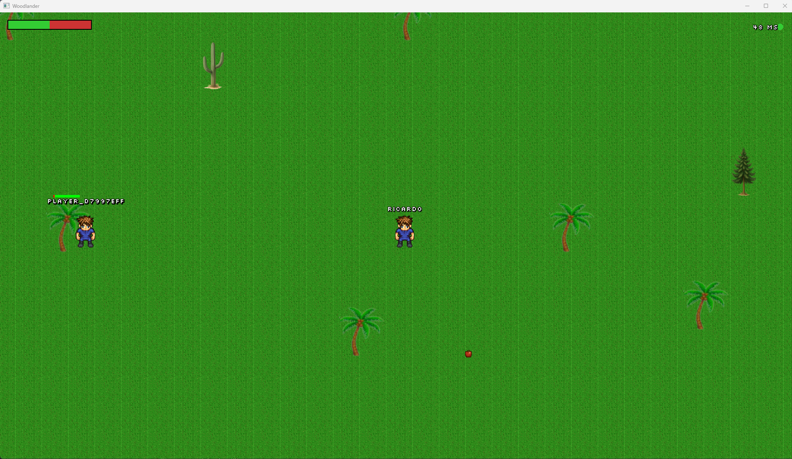
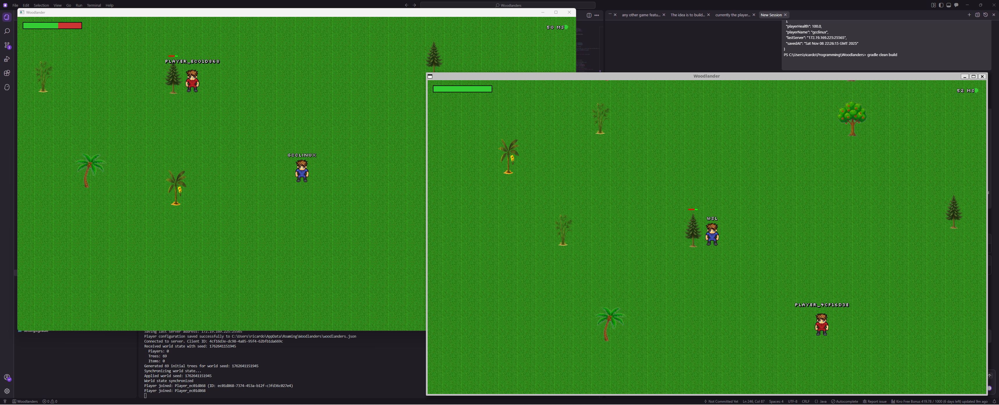
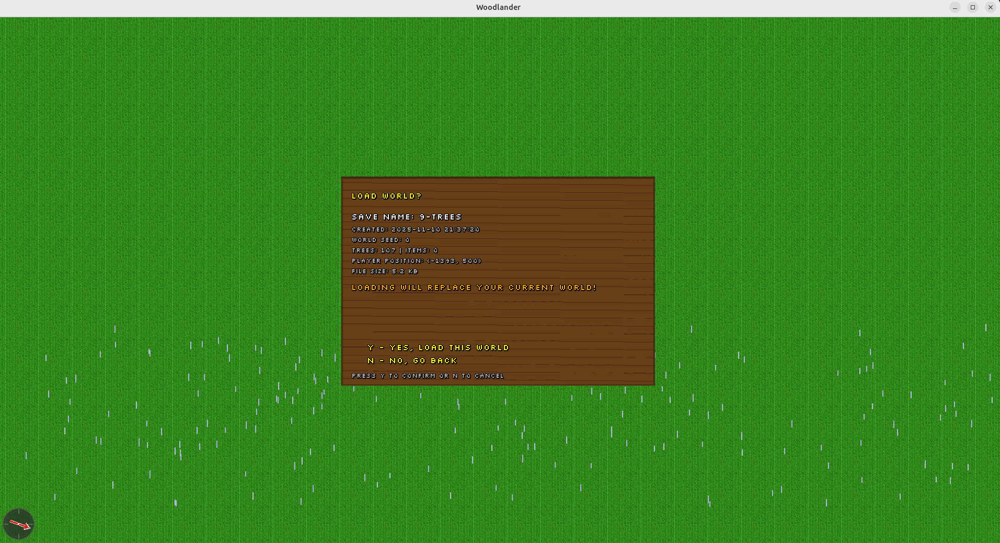
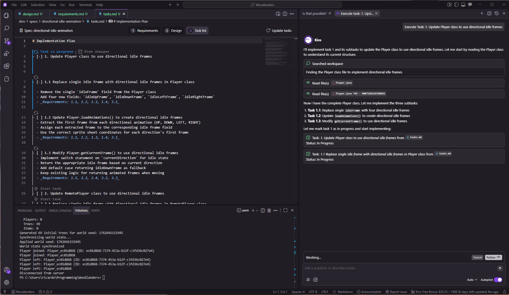
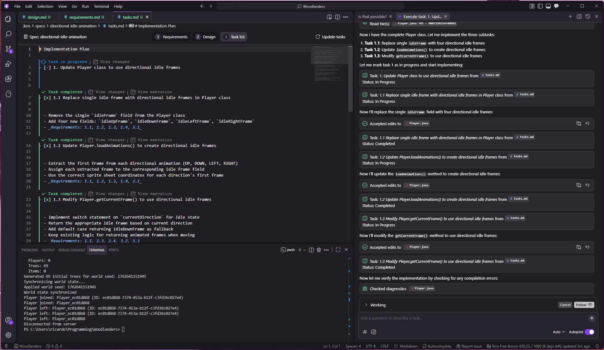

SOme screenshots are older the idea is to start adding them based on their version.

### New targeting System

*New targeting system now just to plant bamboo, future attack + more.*

### Farming Bamboo

*Farming Baoom with rain, inventory, trees, items, sand, compas, ping*

### Single Multi

*Example screenshot with rain, inventory, trees, items, sand, compas, ping*

### Multiplayer Compass & Rain - Host Server
   
*Host your own server or connect to existing multiplayer games*

### Single Player Menu - Player Name
   
*Enter server IP and port to join multiplayer sessions*

### Multiplayer Menu - Host or Connect
   
*Customize your player name for multiplayer identification*

### Multiplayer Gameplay - Player 1
   
*Real-time multiplayer with synchronized player movements and actions*

### Multiplayer Gameplay - Attack Tree
   
*Multiple players exploring and attacking tree*

### Singleplayer Menu - Save & Load world maps

*Single player save and load world maps* 

### Kiro IDE & AI Working together Example 1

*Example of starting a task in spec with KIRO IDE* 

### Kiro IDE & AI Working together Example 2

*Example of task in spec Progressing with KIRO IDE* 

> **Note**: All screenshots are 800x600 resolution showcasing multiplayer features.

